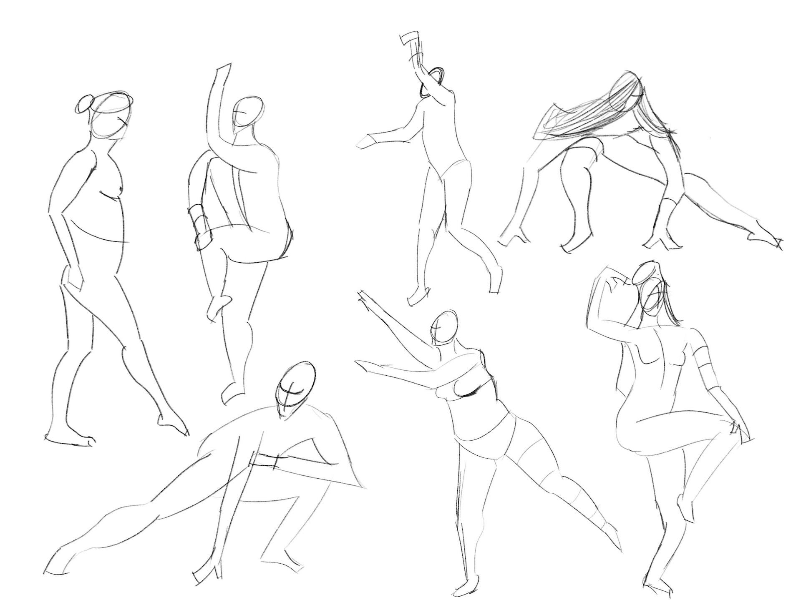
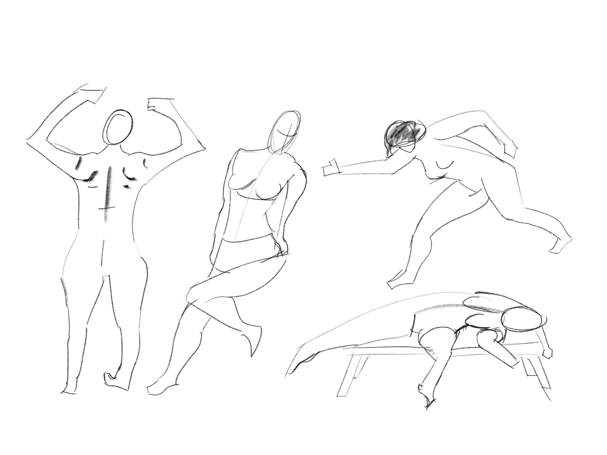
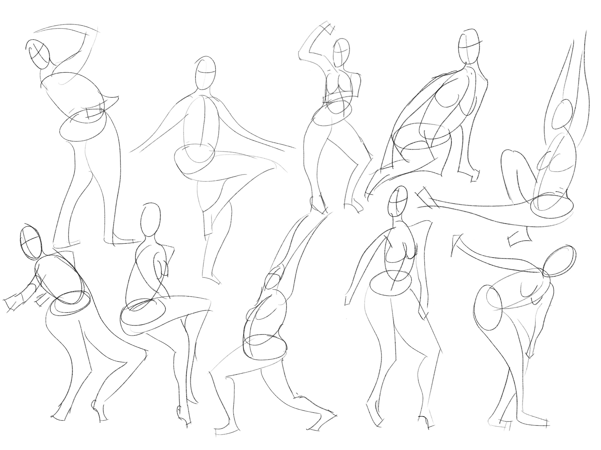
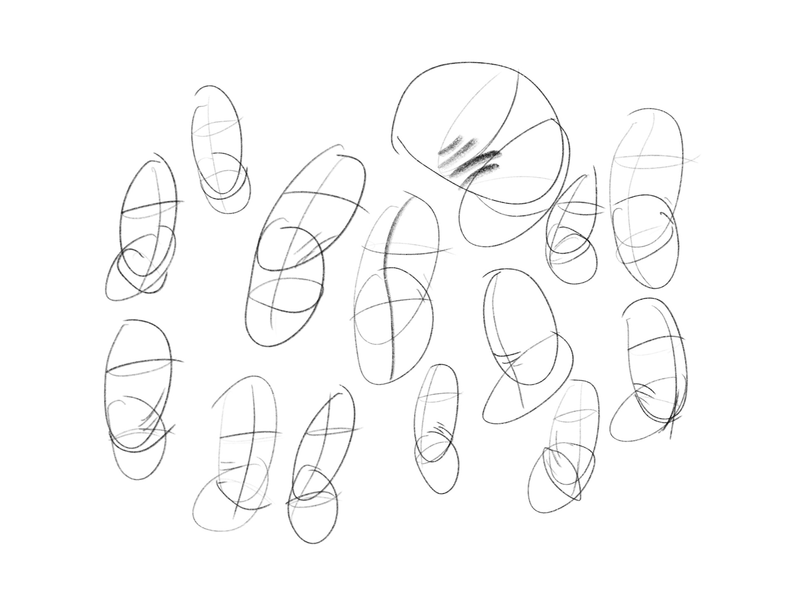
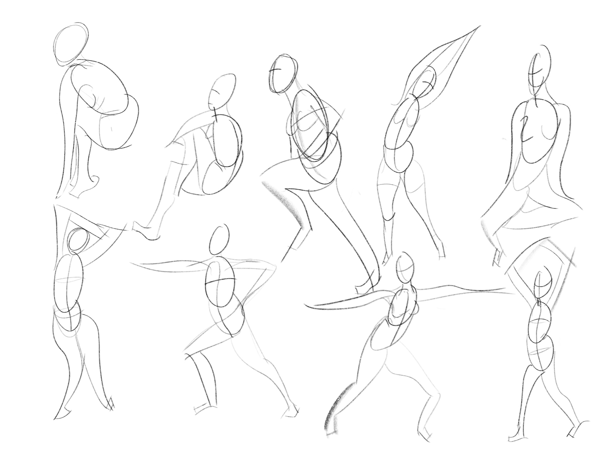

# Figure Drawing 2, Week 3
Week of August 22 \
4h 5m of drawing

## Monday

1h 5m \
Watching Proko's video on [how to draw gesture](https://youtu.be/74HR59yFZ7Y) made me realize that I've never really learned how to do this -- Kenzo's course taught me how to past shapes together to draw figure in the front, back, and side views, but I was always overly focused on contour as opposed to gesture.

Today I got in the groove of drawing the movement of a figure in two minute timed drawings, as opposed to getting caught up in the anatomy right away. I think this led to the drawings looking more expressive and less stiff.

## Tuesday

1h 35m \
More timed gesture practice, along with learning the method of [the bean](https://youtu.be/0660Fuih7qo) for drawing torsos. Tried applying it to the gestures in the last page of drawings for today, but haven't quite gotten it down yet

## Saturday

25m \
Spent the past few days engrossed in making an [animated music video](https://youtu.be/bCVw1h_NJoE) with After Effects for [Hack Lodge](https://hacklodge.org/). I wish I had made time to draw, but I'm back on it now

## Sunday

1h 0m \
Last day in NYC before flying back to Toronto. Drew some gestures, then read the first half of the graphic novel [Blankets by Craig Thompson](https://www.goodreads.com/book/show/25179.Blankets) and tried drawing a frame from it.

Failing at this reminded me that I have a long journey of improvement ahead of me, but I'll get to the level I want to be at one day

