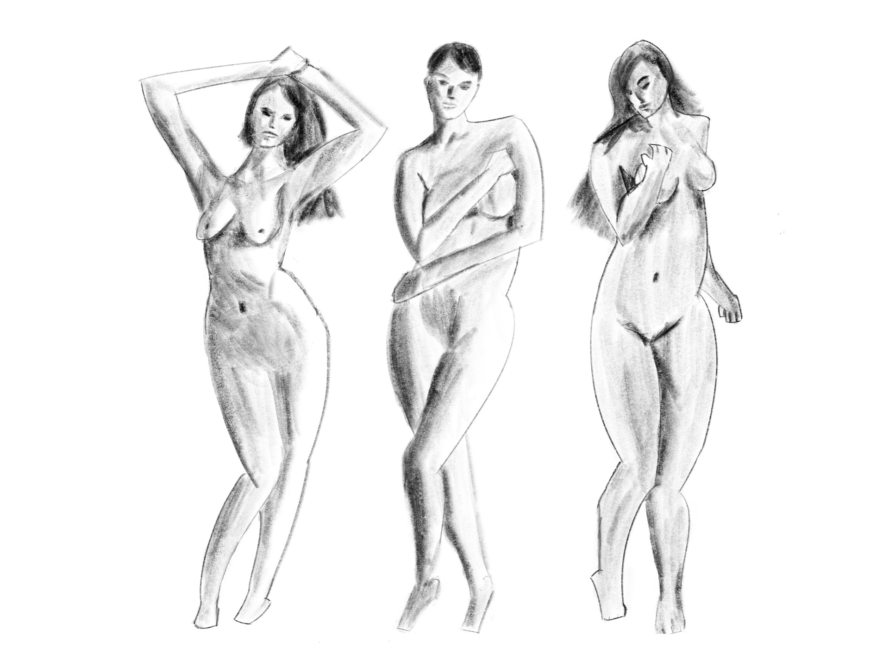

# Figure Drawing 2, Week 4
Week of August 22 \
6h 25m of drawing

Took a break from doing 2 minute gestures, and took my time drawing a few figures. Sometimes it's hard to see improvement when you're doing technical drills repeatedly, but it's weeks like these where I can to appreciate the progress I've made.

