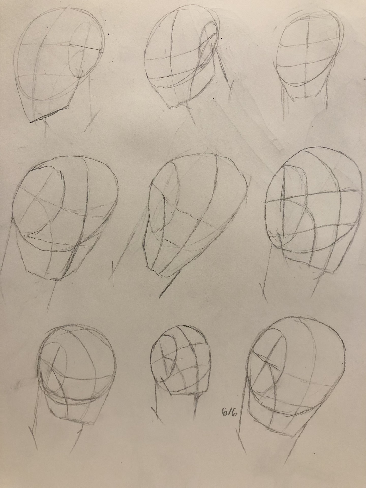
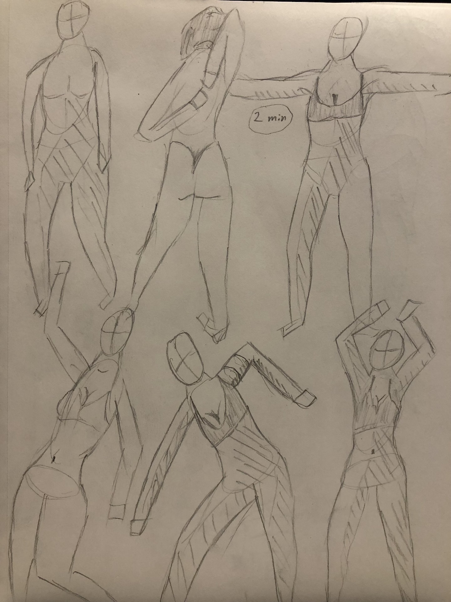
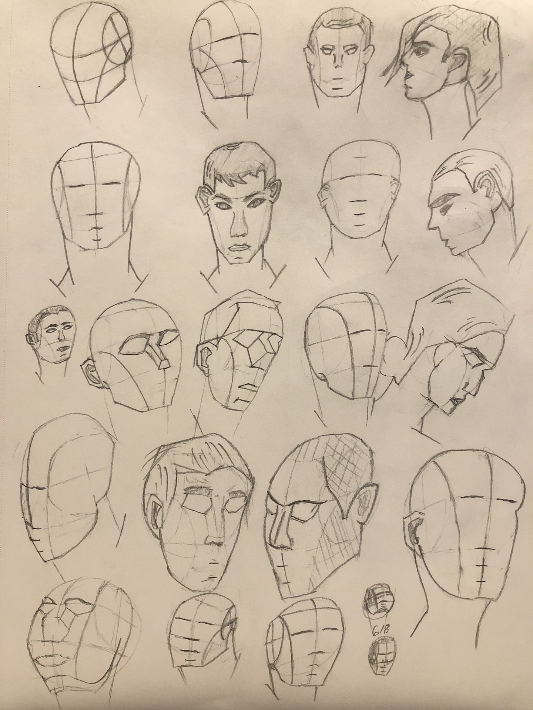
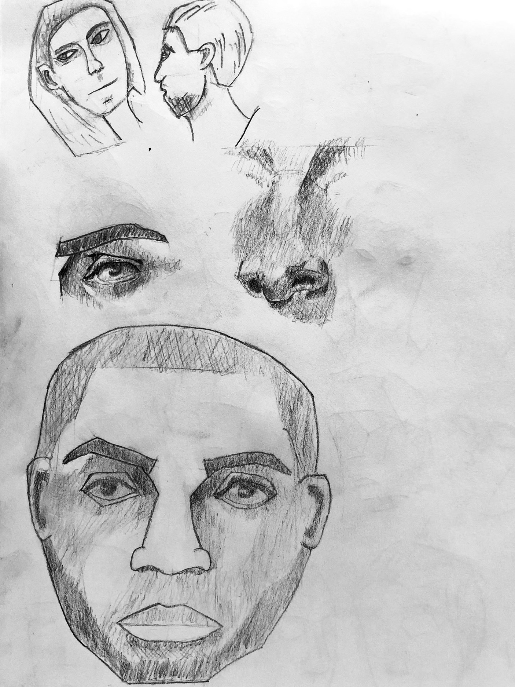

# Head Anatomy 1, Week 1
Week of June 6 \
7h 50m of drawing

My first time drawing heads more detailed than just oval outlines!

Right before this week started my girlfriend flew from Seattle to SF to live with me for the week. Had fun exploring SF together so I spent less time drawing than usual.

## Monday

1h 20m drawing \
Watched Proko's introductory video on the Loomis method for drawing heads and practiced for an hour until my gf got bored and asked to do timed figure drawing together.

Really happy with my 10 minute figure below. I feel like I've gotten a handle on all the material I've watched and read so far on figure drawing.

The next big improvement in my figure drawings won't come until I start working through Proko's figure drawing videos on the [Robo Bean and Mannequinization](https://www.youtube.com/playlist?list=PLtG4P3lq8RHGuMuprDarMz_Y9Fbw_d2ws), and I'm happy to work on head anatomy and perspective for a few weeks until I go back to figure drawing

## Tuesday

No drawing, spent the evening with my gf at a board game cafe

## Wednesday

3h 15m \
Watched a few more Proko videos on the Loomis method, then got lost in the flow of time while drawing two dozen heads. It was fun to alternate between deliberate practice of the Loomis method and doodling in hair, eyes, and other features. 

## Thursday

No drawing, went to a mansion with gf for an multi-course dinner with experimental food

## Friday

No drawing, went to Covet's live show with my gf. Had to leave a bit early, but it was nice to see [Yvette](https://youtu.be/_qUaPjLrPjM) play in-person since she's the musician who inspired me to start playing guitar last year.

## Saturday and Sunday

3h 15m \
Spent the weekend at my gf's house in the East Bay.

On Saturday, we went on a double date to an amusement park, and the other bf there was the first person I've ever spoke to who's earnestly trying to make visual art their full time career -- this was really encouraging for me.

Asked him lots of questions about his experience as an art student, I'm a bit jealous of the social legibility that comes with being an art student in uni vs being self-taught. On the other hand, I confirmed my hunch that the curriculum I made for myself covers all the material that an undergrad works through, I just need to maintain the work ethic and good vibes outside of campus.

Was able to get a fair bit of drawing done in the evenings. I drew the eye and nose while following [Proko tutorials](https://www.youtube.com/playlist?list=PLmzfkaWqrnnUUFsbKxfMh2EJQ9hODQKoh), but the face was drawn from reference. I'm really happy with how it turned out.

Next week I'll work through the Proko tutorials on lips, ears, and hair -- and then draw a dozen or so heads putting together the Loomis methods with these features in different head orientations.

