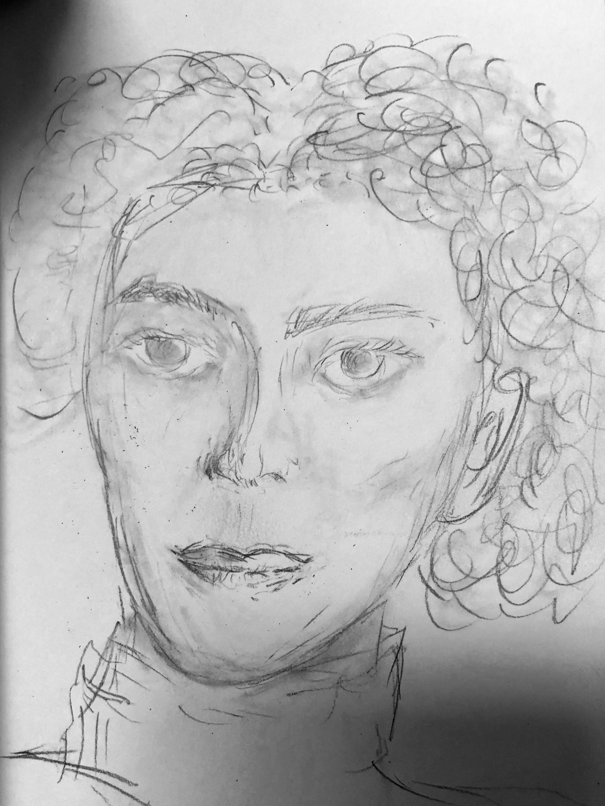

# Head Anatomy 1, Week 3
Week of June 20 \
5h 42m of drawing

Had a dozen of my closest friends in SF for Interact. We're normally scattered across the continent, so I spent most of this week hosting dinner parties / playing DDR / walking around the city with them instead of drawing.

## Wednesday

2h 40m drawing \
I really like how well defined the planes of the face are defined in the Frankenstein lookalike (bottom-left)

The four faces in the right image were done with a 15 minute timer. They don't look great, but I'm happy to be getting reps in.

## Saturday

1h 2m \
Left: Drew while waiting for my friends to arrive at an event instead of making small-talk with strangers

Middle: Drawn by my friend

Right: Drawn by me, while explaining some principles of giving the face and hair volume through shading to a friend

## Sunday

2h 18m\
Left: Unfinished

Middle and right: quite happy with these, feeling comfortable with drawing faces in 30 minutes.

Feeling similar to how I did at the end of 3 weeks of figure drawing
- I'm happy with my improvement
- I'm consistent with my quality given 30 minutes
- There's room for improvement, but I'll have to study more theory
- I feel ready to move onto the next topic: perspective!

