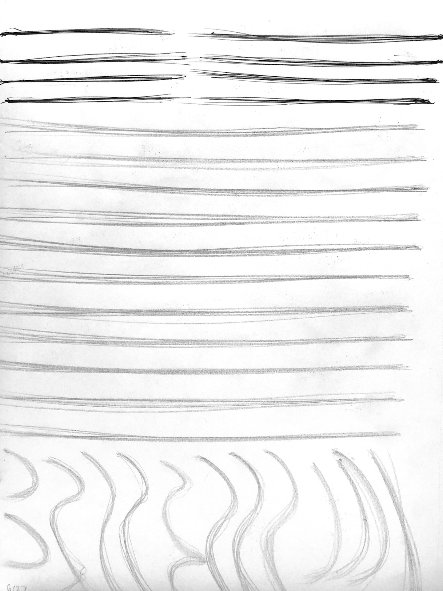
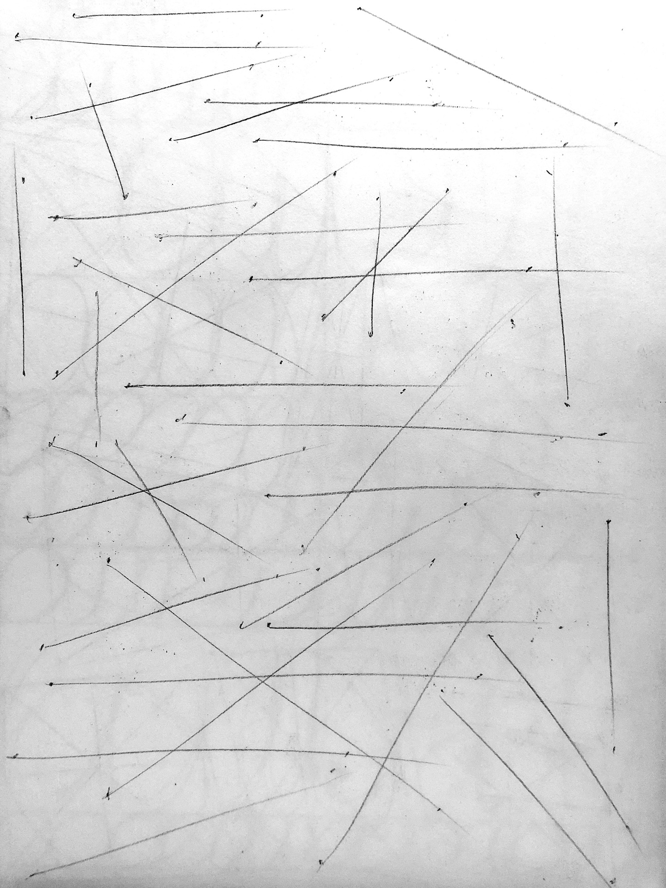
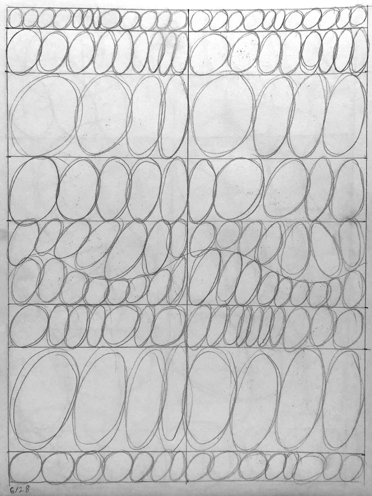
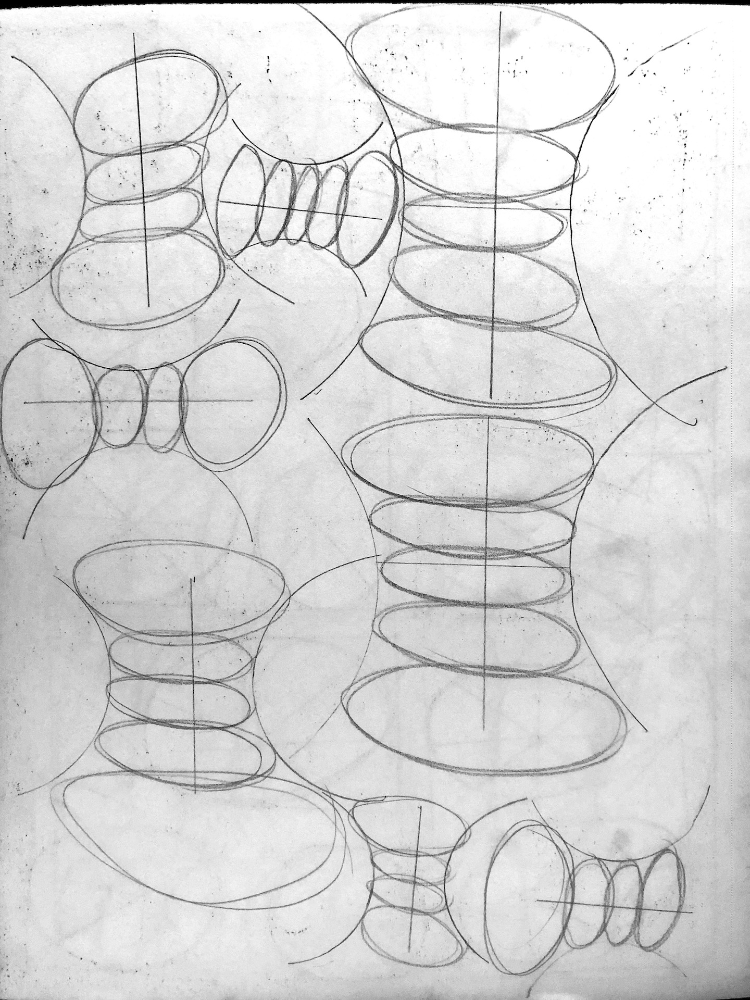

# Perspective 1, Week 1
Week of June 27 \
8h 5m of drawing

This week I entered my deranged artist era, where I draw the same basic forms endlessly (to learn perspective via [draw a box](http://drawabox.com)

## Monday

40m drawing \

## Tuesday

1h 5m \
Realized that I'm a lot better at controlling the bounds of these shapes then last time I attempted draw a box. Glad to see that figure drawing and head anatomy has improved my line accuracy.

Drawing ellipses feels meditative.

## Friday

1h 25m\

## Saturday

2h 0m\
Boxes have a lot of room for improvement, but I'm happy that I'm able to draw from the shoulder and get their convergences to all lie within fairly small bounds.

## Sunday

2h 45m\
Drawing rotated boxes made how vanishing points imply orientation finally click for me.

