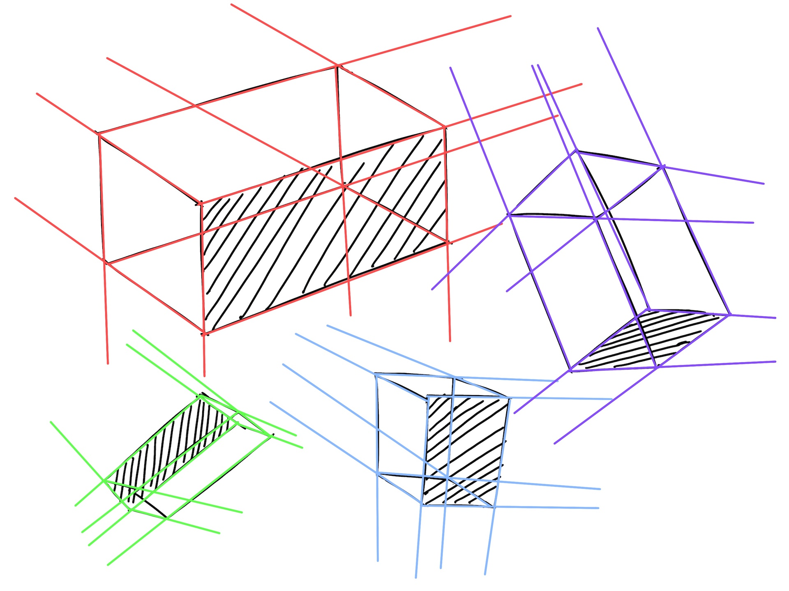

# Perspective 1, Week 3
Week of July 18 \
8h 5m of drawing

After last week's diversion to get comfortable with drawing on the iPad, I'm back to working through [Draw a Box](https://drawabox.com/)

## Tuesday

1h 10m \
The reference I drew from today was actually one I drew 3 weeks ago. In the pencil/paper sketch I didn't want to shade the left half b/c I was worried I'd mess up the sketch. Comparing the two is a nice example of how I'm more willing to shade more boldly on the iPad since erasing is so much easier digitally

## Wednesday

2h 5m \
Not feeling too great with drawing ellipses and controlling their degree of rotation. I'll do a page or two of ellipse tables next week to brush up here

## Thursday

45m \
First time trying to draw textures -- I tried to draw the cast shadows of a crumpled piece of paper from reference, but I don't think I did a great job

## Saturday

2h 25m \
Textures: paper, scales, and rope

## Sunday

2h 25m \
Textures: once more!

