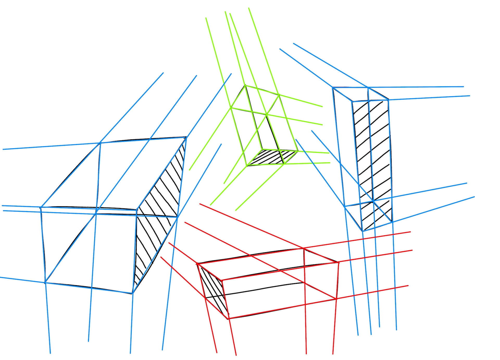
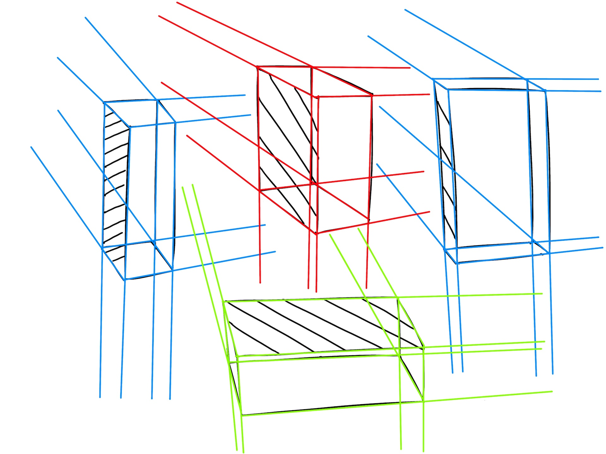
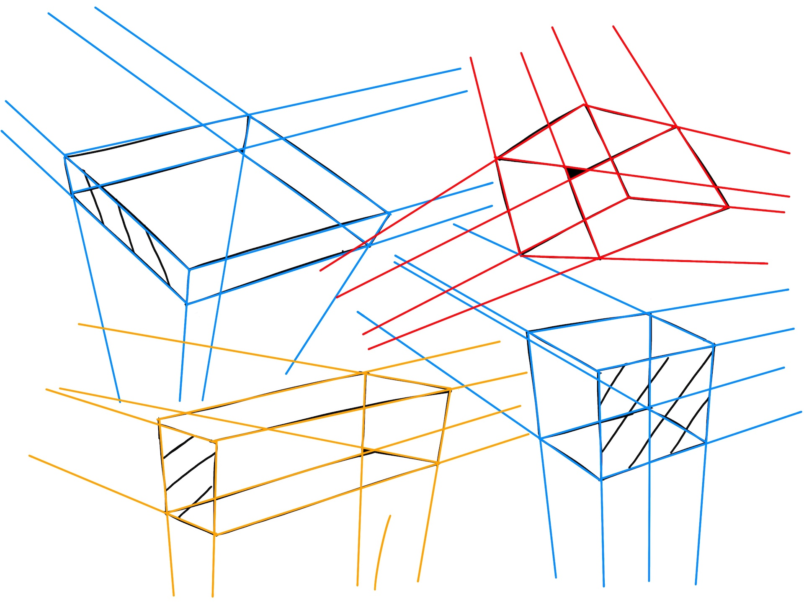
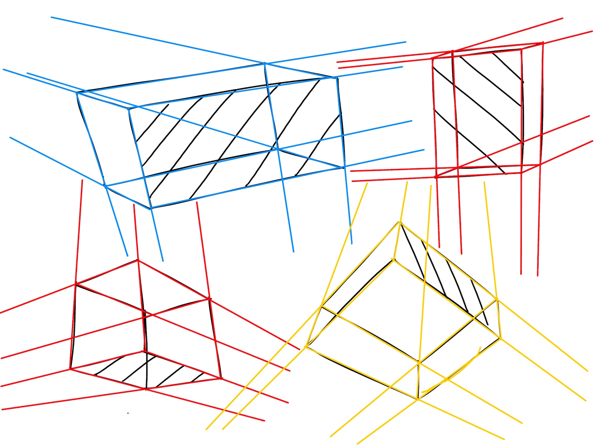
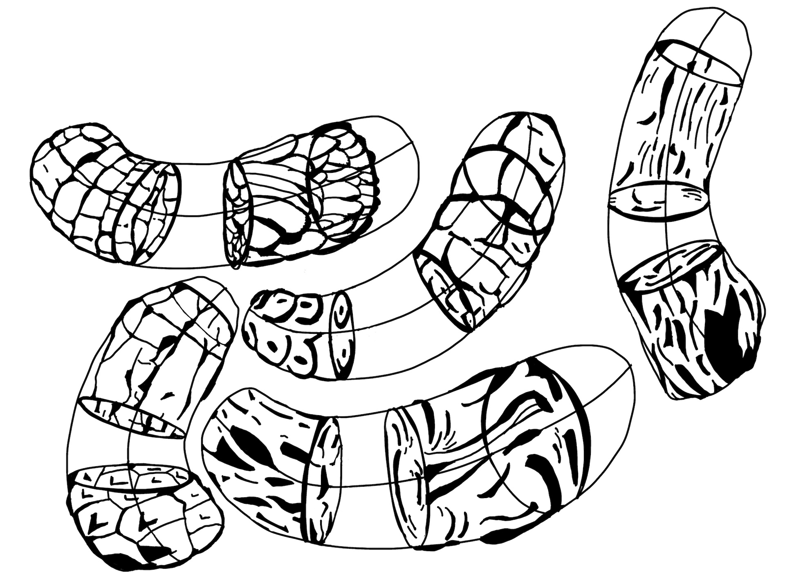
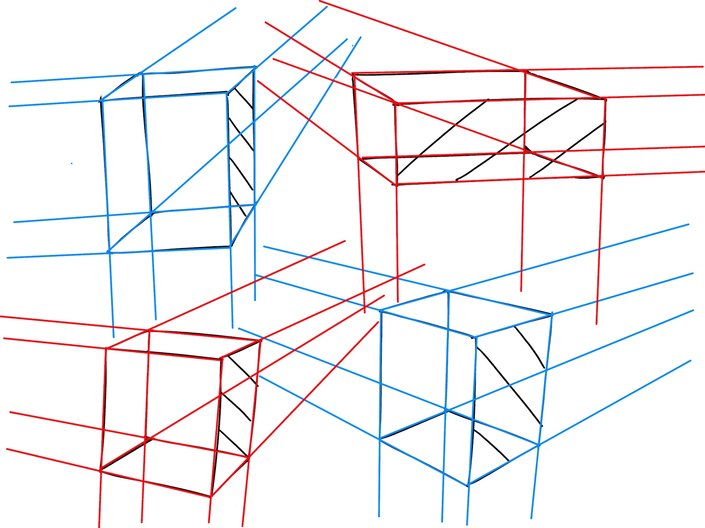
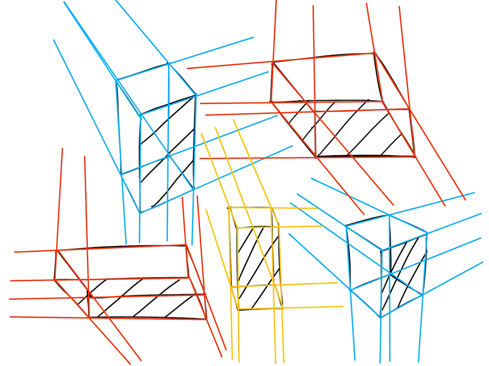
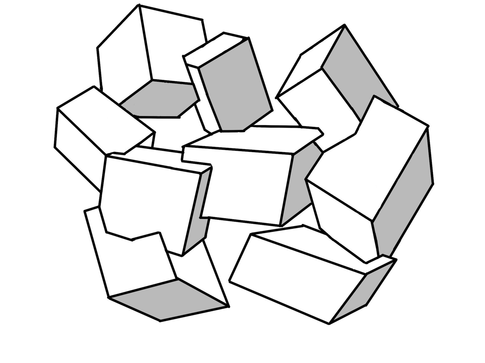

# Perspective 1, Week 4*
Week of July 25 \
5h 7m of drawing

This week wasn't very productive due to an expected traumatic event that occurred Tuesday evening. Took me most of the week to get back in the groove.

Week of August 1 \
3h 14m of drawing

Another slow week for drawing progress. Most of my time got sucked up by moving out of my SF apartment, but I should start waking up early in the morning and drawing for an hour to start off the day to make sure every week is moving me forward

