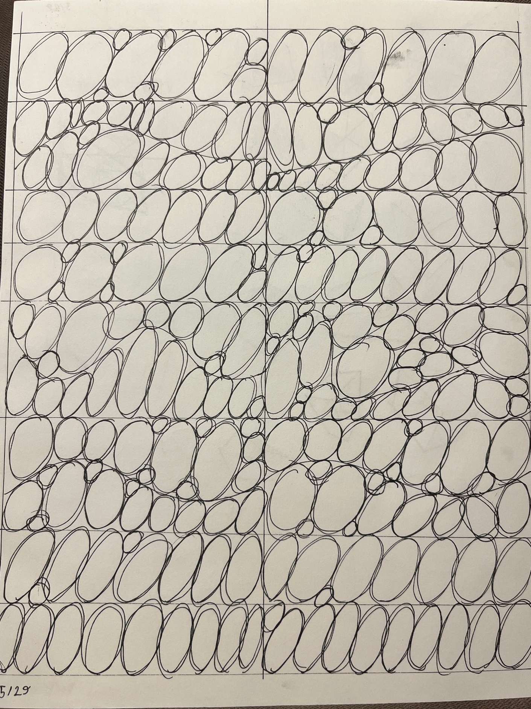
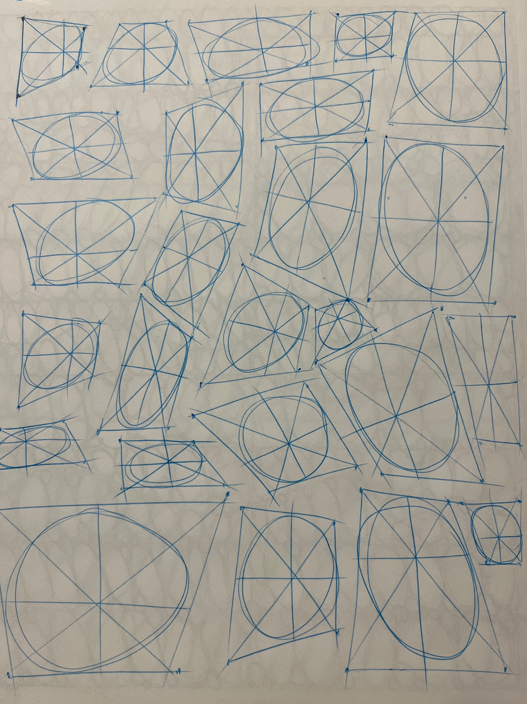
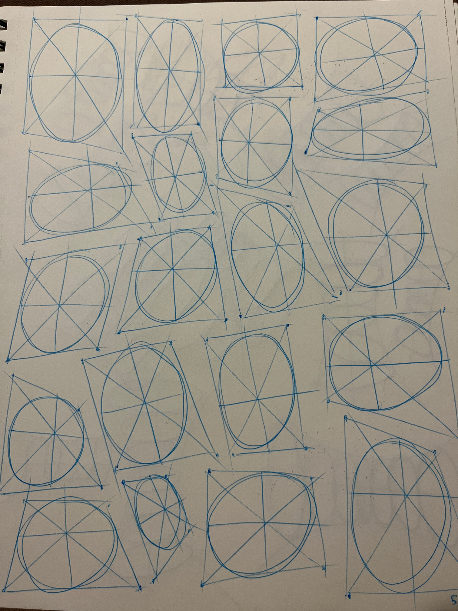
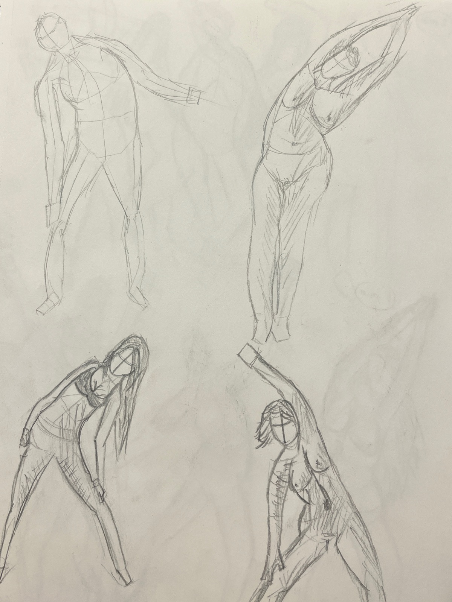
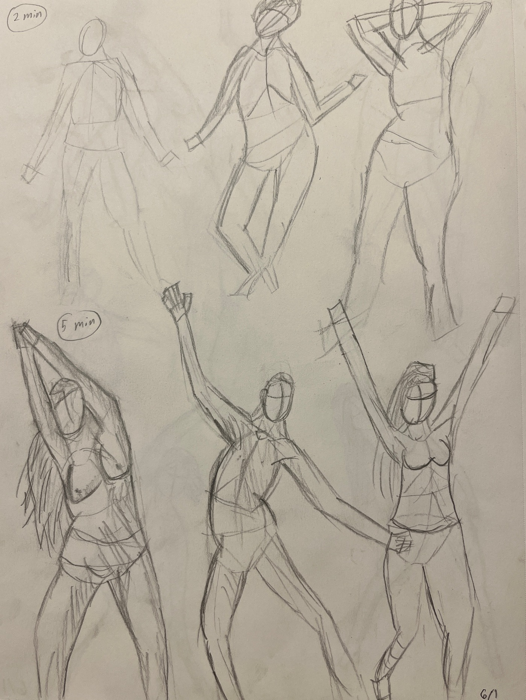
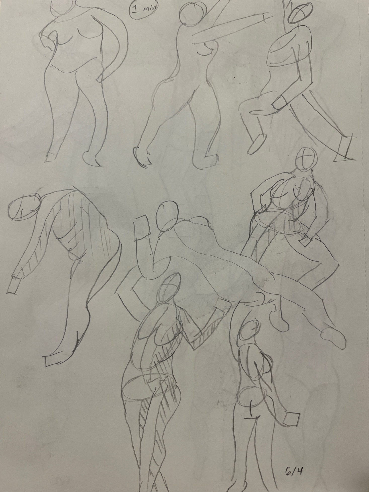
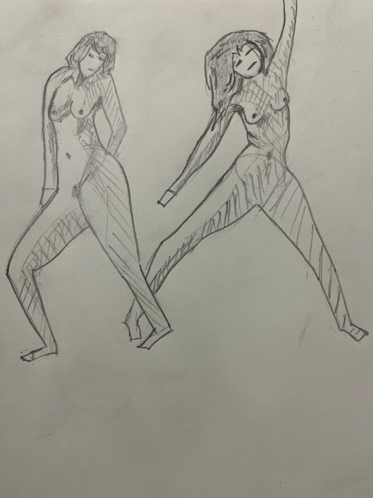

# Week 1, Figure Drawing 1
Week of May 30 \
11h 42m of drawing

Overall a pretty good start to [art home school](/art-home-school.html), but I'd like to draw for >20 hours next week

## Monday

2h 30m drawing \
2h planning art home school

No better way to spend a day off work than drawing ellipses. Feeling hopeful about the progress I'll make over the next few months.

I love the idea of slowly accumulating dozens of weekly progress updates, so it's clear for myself and others to see how going from complete beginner to decent is just the result of consistent practice.

## Tuesday

Today was demoralizing. Last month I had drawn lots of gesture and boxes in a small sketchbook, which I only now realized led me to rely on drawing with my wrist instead of shoulder.

Trying to draw tonight with my shoulder in a larger sketchbook felt so unnatural and I was pretty unhappy with the results.

## Wednesday

Started the day by watching the videos in week 1 and 2 of [Figuary](https://www.youtube.com/playlist?list=PLXkHosWORUv66_H0YBErfIyIJkmBE71NR). Some review of figure drawing fundamentals (squash/stretch in torso/pelvis, capturing gesture in a few lines etc), and some new details on shading figures

Today was my first attempt at doing timed figure drawing (2 and 5 minutes). The time pressure helped me stress less about mistakes and just enjoy the process.

Main thing I'd like to improve on with these drawing is exaggerating the gesture to more clearly tell a story with a single figure. Feeling a lot better at drawing in a larger sketchbook with my shoulder already.

## Thursday

Watched the videos in week 3 of Figuary

Feeling more comfortable with shading figures to imply volume.

## Friday

No drawing today... was very productive at work, which made me too exhausted to do anything once I got home

## Saturday

Finished watching all the videos in Figuary

First time doing timed figure drawing with my gf over facetime. Was a lot of fun, she did a lot of drawing while growing up, but hasn't done much art over the past few years.

When we compared our drawings of the same models, I felt a pang of jealousy because hers were a lot better than mine, but a moment later I realized that I'm...
- enjoying the process
- confidant that I'll improve quickly
- sure there'll always be artists who are better than me
- really happy that I get to study the same thing with my partner

Made the red pen sketches while I was on the bus, was fun to draw from life and notice the person sitting beside me watching me draw

## Sunday

Did a pair of 15 minute sketches (last pic) to end the week on a good note

