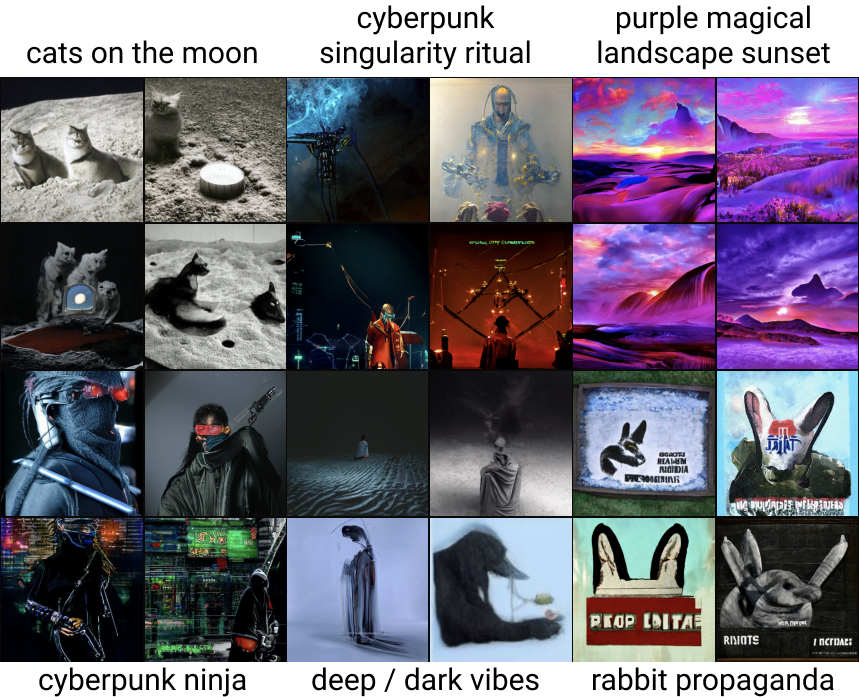

# YouTube rewind 2021 except it's about me and there's no videos

## September 2020
Inciting incident: I leave Toronto and my girlfriend to fly to San Francisco and attend university at Minerva.

One of the main reasons why I wanted to go to university instead of working right away is because I wanted to get to know and spend time with people my own age who weren't all in tech.

To this end I set up 30+ hour long 1 on 1 walks with people in my school. I took people on expeditions to

- Corona Heights (my favorite)
- Yerba Buena Gardens
- The Painted Ladies
- Golden Gate Park
- Ocean Beach
- Dolores Park
- Coit Tower
- Twin Peaks

I also organized weekly movie nights where I'd cook dinner for everyone -- slowly finding my [favorite recipes](/cooking).

Exploring San Francisco was fun, but after spending dozens of hours with my classmates in an accelerated period of "getting to know each other", I knew that I didn't want them to be my entire peer group for the next 4 years.

It felt like if I wanted to learn, I'd learn more by working full-time, and if I wanted a vacation it was irrational to be in an institution where I had to spend time on classes I didn't want to be in.

### Side Quest: Flirting with Triangles
In the summer prior to university I read Masters of Doom, which was about id Software and John Carmack. After having spent 2+ years being immersed in machine learning internships and projects that, at times, required incantations to the god of boxes that are black - the world of graphics programming felt refreshingly concrete.

I spent 100s of hours on graphics programming projects

- Worked through all of [LearnOpenGL](https://learnopengl.com/) and learned a ton of the fundamentals of graphics programming
- Built a ray tracer following [Peter Shirley's guide](https://raytracing.github.io/books/RayTracingInOneWeekend.html)
- Inspired by the [demoscene](https://github.com/psenough/teach_yourself_demoscene_in_14_days), I made some [fragment shaders](https://www.shadertoy.com/view/tlSyzG)
- Learned Vulkan and built a [rendering engine](https://github.com/LiamHz/Excal) and Perlin noise terrain generator
- Wrote an article about how [Vulkan and the graphics pipeline work](/blog/vulkan-fundamentals)

The article [did well](https://www.reddit.com/r/programming/comments/hxoekp/fundamentals_of_the_vulkan_graphics_api_why/) and I started getting Twitter DMs from companies asking if I wanted to do internships with them.

It felt fun to be the hot girl. I set my eyes on Activision's advanced R&D lab, and got a technical interview scheduled with their CTO.

To prep I read through the first quarter of [Real-time Rendering](http://www.realtimerendering.com/), and reviewed my old projects. I did well in the interview, but due to bureaucracy I didn't get the role on the spot, and was put on a shortlist -- and left uni before I made it to internship season.

Maybe God just didn't want me to advance the state of the art for hair rendering in Call of Duty.

In the year since then I haven't done much graphics work, but I'd like to return at some point. I'm not interested in this as a career, especially w/r/t research, but it'd be fun to make some mind-bending graphics projects again soon.

## October 2020
At the beginning of the month I was added to a group chat, and one person mentioned that they were organizing a group house in the middle of nowhere.

I got on a call with the organizers, and two days later was on a flight to New Mexico.

Meeting new people that you really like is exhilarating, and this group house had [28 amazing people](https://bio.school2point0.com/).

In our first month together we ate lunch and dinner together every day. Meals lasted for hours since it was the only time we could socialize in groups for the two weeks we all quarantined.

I was in love with co-living, and started to read a lot about [building and maintaining communities](/blog/community.html)

After quarantine we started doing weekly demo nights. At my first demo night I made a CLI that found similar patents given a description of a patent (using universal sentence encoders and the Google Patents API). The following week I learned Figma and hacked together a web app for this project.

There was also a great culture of getting to know one another. I went on lots of long walks around New Mexico's valleys and overlooks while getting to know people, and also a few fun group hikes.

Everybody at this house was amazing, and it made me realize that I didn't have to outsource my friend-making to an admissions officer, so I dropped out of school.

...and I climbed a mountain.

### Side Quest: Playing Piano Again
After taking piano lessons for 4 years, I stopped in the summer of 2019, and hadn't played much since.

But unlike rendering hair, I think fate wanted me to create music -- the house had a beautiful grand piano.

It was nice to have a solitary relaxing activity, and I relearned all of my [favorite pieces](https://github.com/LiamHz/piano-sheets).

## November 2020
I dropped out without a plan -- and then realized I probably should find a job. A housemate, [David Holz](https://twitter.com/davidsholz), was kind enough to get me interviews with three of his favorite companies.

At this point that I realized that I didn't have to worry about finding a job in software, which was a relief since I had just dropped out.

I started a month-long contract project with [Reduct Video](https://reduct.video/) building NLP tools to annotate and edit videos. I got a lot done during these weeks and shipped two of my projects.

Despite all this job stuff I still found time to spend more time to talk and build with housemates

- Built a [fragment shader rendering a Mandelbulb](https://www.shadertoy.com/view/WdcfWf) with Stephen Fay
- Built Pico, a tool to make sense of your computer usage, with Taylor Rogalski
- Hosted Starcraft house LAN parties where 8 of us would play free-for-all, team battles, and eat junk food.

And lots of outdoor adventures

- Sledding
- Group stargazing
- Walking for hours towards a mountain on the horizon which never seemed to get closer

My favorite was a 24 hour road trip to the [White Sands](https://www.nps.gov/whsa/index.htm), the sand dunes look like snow!

This trip is also when I read Norwegian Wood, a book that's shaped a lot of [how I think about relationships](/blog/echoes) and what being a good person means.

## December 2020
I finished my contract at Reduct Video, and started working full-time at [Numerai](https://numer.ai) which is where I still work.

My first two weeks at Numerai weren't too eventful, just got onboarded and did a few small tasks. Also wrote a [Twitter thread](https://twitter.com/LiamHinzman/status/1341064191688364032?s=20) explaining what Numerai does via memes from our users, which was a nice dopamine hit.

The New Mexico group house ended, and I moved back to San Francisco. I was lucky enough to be offered to live with Numerai's founder, so I could settle in and save on rent.

Covid fears were high at the time, so I didn't get to see any friends, or anybody at all for that matter, over the holidays.

To keep myself in good spirits I bought a nice digital piano with weighted keys.

## January 2021
Living alone is awesome, it's so quiet!

I kissed a girl and I liked it\
Then she ghosted me へ(^^へ)～

Living alone is lonely, it's so quiet.

Not being able to see anybody in-person was really hard on me. I value having time alone to focus, but after two weeks of solitary confinement I start to go crazy.

Every day I'd get lots done during work, exercise, cook, play piano, and then have no idea what to do with the remaining five hours of my day.

I got pretty depressed and started thinking things like "Is this all there is to life? Work and entertainment for escapism?"

I read a lot of books and philosophy searching for answers, but Camus isn't much help when you're depressed because you're monkey brain is going crazy. Looking back, I think that reading and reasoning won't get myself out of depressive spirals, but being a social butterfly will.

Five fun things that I'm keeping as bullet points b/c I'm lazy

- Discovered the magic of grocery delivery
- Listened to [Akira the Don x Jocko Wilink](https://open.spotify.com/album/5zSfOxsBE4yFfcbc2gRd4q?si=2GbKvyQ9T3q0bx2CD3SZFw) on repeat
- Watched an two hour [documentary](https://www.youtube.com/watch?v=JsNm2YLrk30) on a Russian video game I had never heard of, and it was the best thing I had watched in months
- One day I had to do laundry after winning an hour long battle with a change machine to turn my $5 bill into quarters
- Learned GraphQL / Elixir / Pandas / SQL because my co-worker who assigned me tasks assumed that I already knew these things

## February 2021
Friendship ended with depression\
Now Richard Craib is my best friend

After the Numerai founder moved in with me, I immediately felt happier and more productive.

I had lots of good late-night conversations with Richard. Topics were wide-ranging, but nihilism was a recurring topic. These conversations were what made Richard like me, and offer me to stay at his place until the summer.

We also watched a lot of films together

- Memories of Murder
- The Endless
- Unforgiven
- Primal Fear
- Swallow
- Friday
- Safe

Teach me how to work work work work work

- Added a new metric, [feature neutral correlation](https://forum.numer.ai/t/feature-neutral-correlation-added-to-the-tournament-site/1669), to the Numerai website. Was a fun end to end project: ranging from data pipeline changes to website UI.
- [Revamped](https://forum.numer.ai/t/updated-signals-validation-data/2040) the validation data we give for our [Signals](https://signals.numer.ai/) tournament. Previously it was a static file that ended over a year ago, now it updates every week with new data, making time series methods more viable.

Some other funsies

- Played team Starcraft with Richard and David
- Exercised every morning with MikeP and Richard
- Got back together with gf on Valentine's day. We hadn't talked in months: I surprised ordered her McDonald's, and we spent the rest of the night talking

## March 2021
Got an electric guitar and completed a beginner's course

Lived in Brooklyn for two weeks with Dhruvik and Will Bryk from New Mexico, and some of their friends.

Improved Numerai's data tournament, [Signals](https://signals.numer.ai/). Added [cumulative correlation graphs](https://forum.numer.ai/t/signals-model-diagnostics-cumulative-correlation-graphs/2440) to users' model diagnostics, and significantly improved the [ticker map](https://forum.numer.ai/t/updated-signals-ticker-map/2239) we give to users.

Became the "face of Signals", handling user questions / bugs / feature requests. Also hosted two [separate](https://youtu.be/WqSxacvH100) Signals community [roundtables](https://twitter.com/richardcraib/status/1372596058077937669?s=20) where I discussed new changes and fielded Q&A with users.

## April 2021
I have zero recollection of this month

## May 2021
Read fantasy novels, watched YouTube, and played video games.

tbh this month wasn't too eventful. I feel like I should add some bullet points, but we still have eight more months to go through.

Hopefully next month is more interesting

## June / July / August 2021
I'M LIVING WITH MY GIRLFRIEND IN CANADA!!!

tl;dr cooking, skateboarding, and making up for our nine months of celibacy.

Some things we did together

- Cooking
- Learned how to skateboard
- Lifted every day at the gym
- Went to McDonalds at ungodly hours
- Watched the Legend of Korra (prev. summer we had watched Avatar)
- Played Dance Dance Revolution at arcades
- Played [Splitgate](https://youtu.be/w5XKcTM_NM8) and Valheim while listening to Paramore

Movies we watched together at home

- The Lord of the Rings trilogy
- The Dark Knight trilogy
- The Girl Next Door
- Horrible Bosses
- The Farewell
- Easy A
- Titanic
- ET

We also saw some movies in theater

- Terminator
- Back to the Future
- Indiana Jones and the Lost Ark
- Shang-Chi and the Ten Rings

Alas, this two-year relationship ends in tragedy. We decide to break up, since indefinite long-distance is hard, and so that she can be as social as she wants during her first year in college.

## September 2021
We now resume our regularly scheduled programming of celibate boy making sense of the world.

Working in-person ᕕ( ᐛ )ᕗ\
Catered lunch every day \^ㅂ\^\
Bouldering near office ヽ(〃∀〃)ﾉ\

Had one of the greatest weeks of my life

- Discovered [MealSquares](https://mealsquares.com/) and resolved to not cook for the next three months
- CoD mobile with Talha and Thayallan
- Witnessed sports cars do donuts and explode at 2am
- Dream Machine hackathon with David Holz and Long (pics below)
- Stayed up all-night talking with new friends: Anson and pickup-artist guy
- First EDM festival, Second Sky, with MikeP. Got to see Porter Robinson, Madeon, and Jai Wolf live

## October 2021
A Numerai office party and hackathon week happened, but other than that I don't remember too much.

New Year's resolution: journal consistently so I have content for 2022's recap

## November 2021
I went to NYC for NFT week (barf) and spent all of my time with Anson and her friends (yay). We went rock climbing, explored central park and the MET, fancy restaurants, bookstores, times square, and tried and failed to exploit creepy men to get into a deadmau5 show.

Once I was back on the west coast, I went to a Seven Lions EDM show with MikeP. Apparently most of his fans in SF are Asian, so I got to feel tall for the first time in my life. The music was great, and the visuals were so cool that I started to learn Cinema4D with the hopes of creating rave visuals one day. 

## December 2021
Lived with Anson on her blueberry farm for two weeks. My favorite moments of 2021 were made on this trip

- Made an [OnlyFans](https://youtu.be/AysX7pa7Kxs) together
- Composing music on piano that started to approach decent
- Slumber parties every day, talking late into the night
- Anime string quartets, Christmas church orchestra and choir, and Noah Kahan
- Bouldering, ostriches, UBC, restaurants, and near-death walks along the highway

\
After Anson's birthday I went back to Toronto for the holidays to see my family again for the first time since I had left for college 16 months ago.

Ahh the magic of family: Christmas dinners, old jokes, and the overbearing presence of parents and siblings.

Which is why I found a house on the other side of the city to live at.

Like last December I was once again living all on my own. Unlike last December, I didn't fall into a isolation induced depressive spiral thanks to my friends: Anson, Ju, Talha <3

**Instead of being sad I**\
Watched Arcane, now one of my favorite shows ever -- the animation, music, and characters are all amazing.

Started playing guitar again, and [learned](https://youtu.be/iTTPhTnND-g) the main theme from Arcane. For the first time I'm playing rock on electric guitar and really enjoying it (e.g. Arcane, Girl in Red, [Polyphia](https://youtu.be/l0IskhSEX4k))

Started composing music again, this time with more "indie acoustic vibes", and writing with piano / guitar / cello / vocals in mind instead of EDM. I have a couple songs mostly finished, hopefully I'll start releasing things soon

## Recap of the Recap
- Left Toronto and gf
- Went to college
- Dropped out of college
- Started working full-time at Numerai
- Learned guitar
- Got depressed
- Got happy
- Got back together with gf
- I don't remember April or May
- Lived with gf for the summer, then broke up
- Work, EDM shows, NFT NYC
- Lived on a blueberry farm
- Started making music
