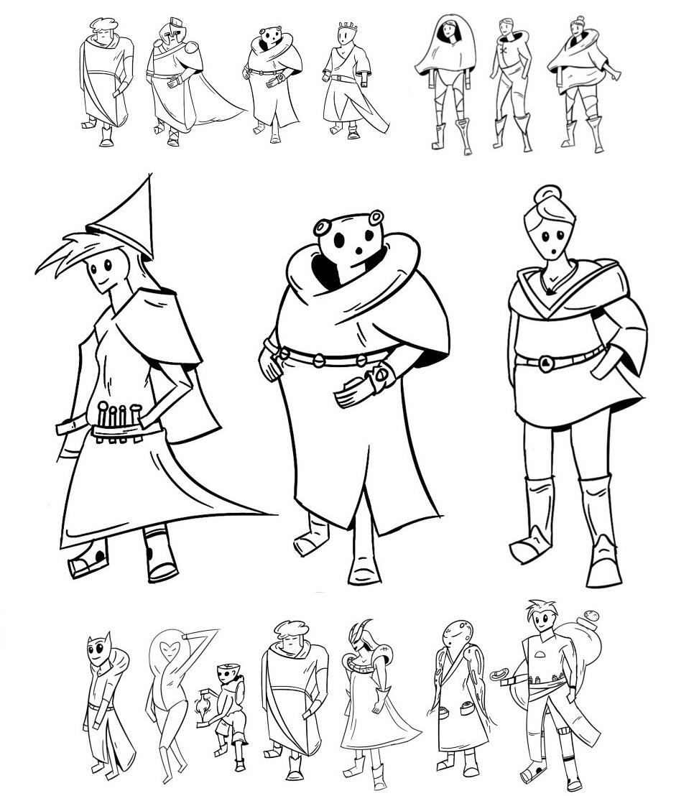

# Why I Left Tech to Pursue Art
Today, I left my job at a tech startup to study art full time.

I've spent 100s of hours the past 6 months drawing, and I'm eager to go all-in. I'm planning to apply to Sheridan's animation undergrad program in February, and have been busy preparing a portfolio for it. Here's some of my recent work, and a [lil music video](https://twitter.com/LiamHinzman/status/1589660449271959552?s=20&t=svNe1i7jQQbYhdQahR1WVg).

In middle-school I competed in Canadian nationals for the board game Go, and gave up on my dreams on going pro when AI defeated the world champion.

In the 7 years since then, the thing that has remained constant in my life is programming. I grew up building AI and computer graphics projects for fun. I skipped class in high school to work at startups, and haven’t stopped since then.

I worked on early versions of Midjourney in September of 2021. I'm aware of the irony of pursuing an art career now.

I've really enjoyed these years, but I want to explore more of what life has to offer.

I don't enjoy working in tech anymore. I'm good at it, am compensated well, and the job is fairly painless. But when I started my first full-time job two years ago, I thought "is this really what the rest of my life will be like? churning out code to solve problems I don't care about?" and that feeling never quite went away.

I've met many people who really enjoy their jobs, both engineers and founders. I'm happy for them, but it's not a good fit for me.

I've also met many young people in tech who feel dissatisfied. Many go through their career attempting to...

Earn as much money as possible, with the hope of
- Finding happiness through wealth
- Retiring by age 30

Found a startup, with the hope of
- Creating meaningful impact on the world
- Becoming someone both themselves and others will admire

**Money**: I grew up poor, but I don’t particularly care about making money. Beyond paying for rent and groceries I don’t have many material desires. The past two years I worked at an AI hedge fund in San Francisco, found myself surrounded by millionaires, and saw that they weren't notably happier than my broke college friends. I really enjoy creating things, and know that this will be true for the next few decades, so working a soulless job to retire early doesn't appeal to me.

**Founder**: I need to learn more, and experience more of the world before I’m capable of bringing a meaningful vision of the world into reality. The problems I’m currently able to solve (CRMs, tools for developers etc) aren't problems that I care about.

I also want to get out of the bubble I currently live in and experience new ways of living.

I've been immersed in tech since I started high school. It’s shaped what I value in myself and others (raw analytical thinking), what I think about (abstract issues and systems), and how I think about these things (optimizing for outcomes).

I think there’s a lot of merit to the "tech way of life". But I also want to try living with different values (kindness and creativity), think about different things (history, culture, and art), and change how I think about these things (emotions and aesthetics).

To make a successful career change, you have to go all-in, rather than just chipping away in the evenings. The worst case with this approach is that I become really good at something I love, don't enjoy the industry, and go back to my previous career for money.

Like everybody, I grew up with a secret unspoken belief that way deep down I was different from everyone else. That I would go on to achieve great things with my life. I’m 20 years old, and if the rest of my 20s went by in a blur of startups and ever increasing salary -- I’d feel like I had wasted my potential.

"I'm just afraid that if I died today, then my life would have amounted to nothing" - Soul, Pixar

