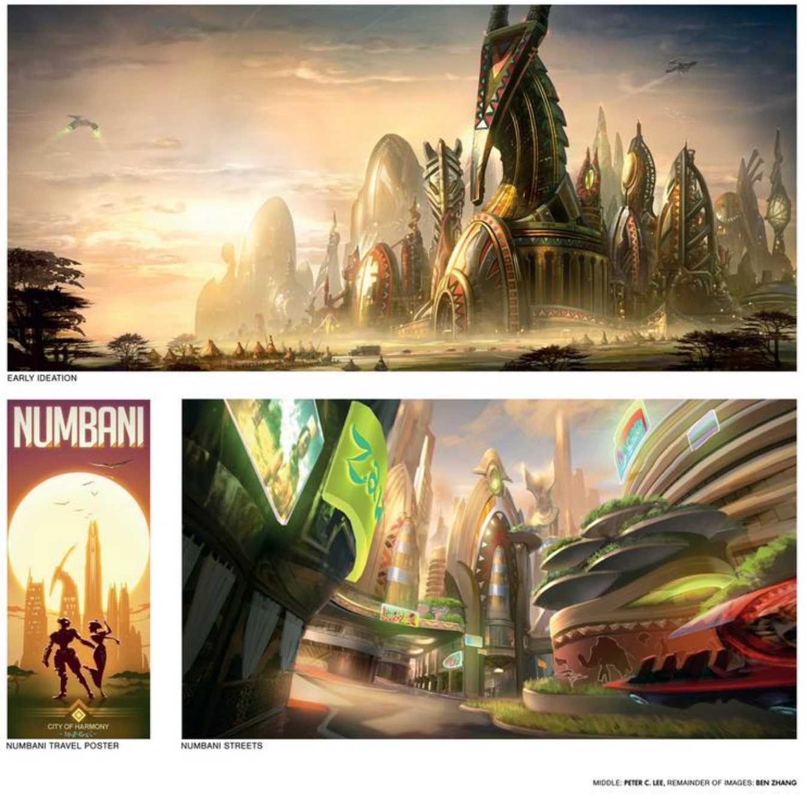
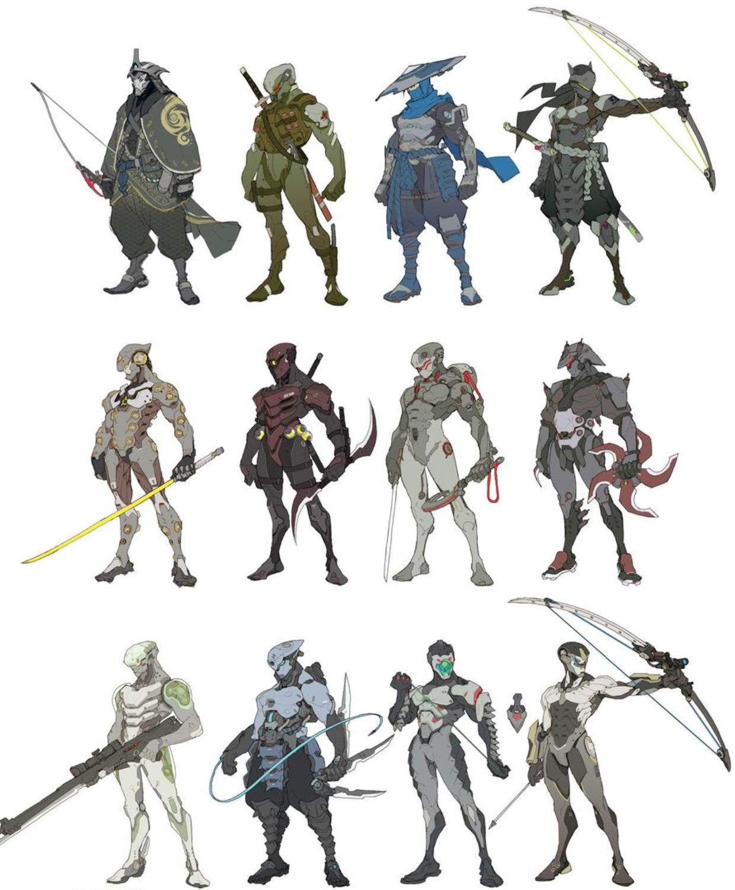
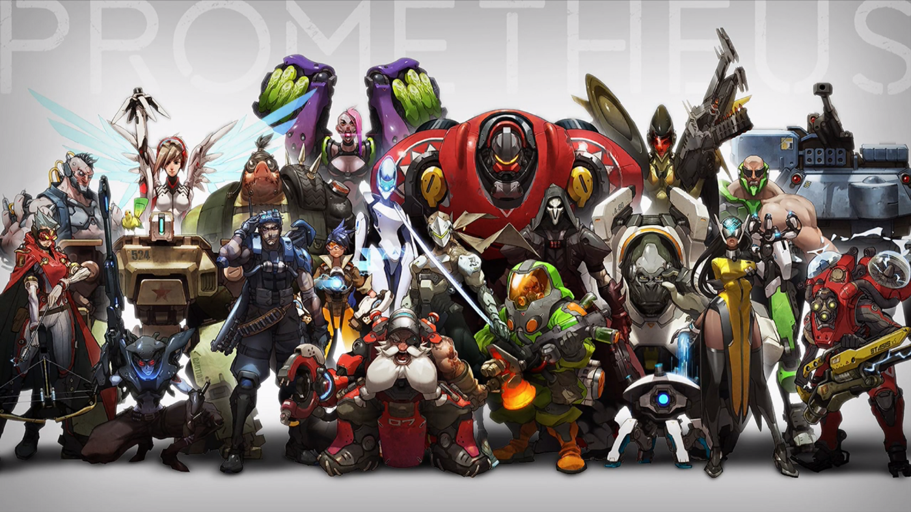
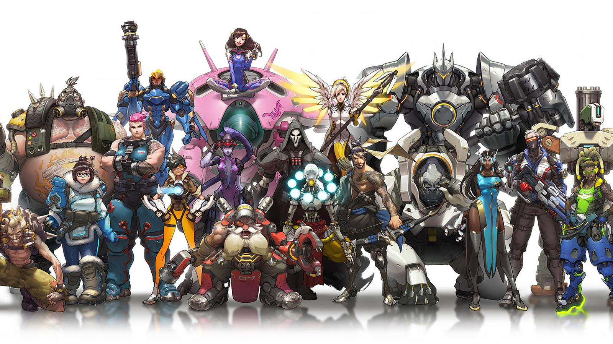

# Possible Worlds: Why I’m Leaving Tech to Pursue Art
In April I read a collection of essays by Hayao Miyazaki

> The most important thing when creating art is that you know what you want to say with it. There are innumerable examples of people making films with a very high level of technique, but only a very fuzzy idea of what they really want to say. When people who know what they want to say make films with a low level of technique, we greatly appreciate the films because there is really something to them.
> 
> When young, nearly all of us want to be taken seriously, as soon as possible. Perhaps because of this we tend to overemphasize technique.

Even while surrounded by a flood of lifeless mediocre art, we still need to drink a good glass of water once in while.

Books like Ecotopia and Walkaway, and that one [solarpunk yogurt commercial](https://youtu.be/z-Ng5ZvrDm4) depict a different way of living: high tech, slow life.

Stories like Arcane, Avatar, and The Name of The Wind show a world where magic is humane and intimate, whereas technology in our world is often alienating and distant.

Lately I've been [spending all my free-time learning how to draw](https://liamhz.com/art-home-school.html). In the near future I want to become a concept artist in the games industry to show how exciting certain possible worlds are, and to make them feel achievable within our lifetime.

Here’s a concept: a highly advanced metropolis in Africa, where humans and robots live together.

On its own this sounds intriguing. But concept art brings it to life.

Concept art is primarily used in the pre-production phase and isn't usually shared with the public, in contrast to illustrators who produce splash art and posters.

In the same way that authors clarify and develop thoughts, concept artists turn vague ideas into art that can be used to refine both the aesthetic and function of an idea.

When the artists for Overwatch were trying to turn the idea of a cyborg ninja warrior into a concrete design, they went through dozens of character concepts. The art quality for each isn't astounding (e.g. flat shading and simple materials) but it's detailed enough to communicate a visual idea and see what is and isn't working.

Design and creativity is just as important as artistic technical ability in this role, and this really appeals to me. The art in itself isn't the end product, but rather a building block to serve something much greater.

In addition to making utopia feel real, I want to make art that plays a role in creating games / movies / shows that build empathy between the viewer and lives that they haven't yet been exposed to
- White male teenagers playing as a [pink-haired lesbian Russian weightlifter](https://youtu.be/2q6s6xrCNTU)
- Kids growing up watching [films with teenage female protagonists](https://www.theatlantic.com/entertainment/archive/2016/10/hayao-miyazaki-and-the-art-of-being-a-woman/503978/) who are defined by their depth and strength rather than love interests
- Teens who feel excluded by what makes them unique watching [a blind girl](https://youtu.be/H9Yk5rictuc?t=38) who neither hides their disability nor lets it define them

I grew up in Toronto, one of the most diverse cities in the world, so during my teenage years media that was conspicuously diverse felt like corporate pandering to me -- but after living in SF for two years, surrounded by racial and economic homogeneity, I've realized how limited most people's perception of humanity is within most cities, let alone people who grew up in suburbs.

The initial concept art for Overwatch's hero lineup was a pretty standard assortment of white male super soldiers, mechs, and mutants.

But after diversity became a guiding principle for character design, the cast became much more memorable.

People don't realize how narrow their worldview is until they either travel (too expensive for most), become close with someone very different from them (rare), or develop empathy by seeing the world through a character's eyes.

Designing worlds that I want to live in, filled with people I want to live with is a big part of why I want to work as an artist professionally.

But I also simply enjoy the process of making art. I can be at a park, restaurant, or airport and all I need to create is pen and paper. I also love how bad I am (for now!). I haven't felt insecure about my level of ability in anything for a long time, since I used to exclusively explore different areas of programming. Being a beginner at something again fills me with wonder and determination to become great.

Which is why in 3 months I plan to quit my six-figure salary tech job and self study art full-time. 

I'm leaving engineering so that I'll have more time for art, but also because I want to run away from the bubble I currently live in and experience new ways of living.

For years I've been immersed in tech, and it’s shaped what I value in myself and others (analytical thinking and intelligence), what I think about (abstract issues and systems), and how I think about these things (optimizing for outcomes).

I think there’s a lot of merit to the “tech way of life”. But I also want to try living with different values (kindness and creativity), think about different things (history, culture, and art), and change how I think about these things (emotions and aesthetics).

I’m not sure that this way of living is better, but I know that I want to explore it. I won’t change much as a person if I stay as a software developer at startups for the next decade, and the thought of becoming stagnant is what terrifies me most in life.

To be completely honest, it’s quite possible that I won’t enjoy working as a concept artist in the games industry. Maybe it’ll feel like I’m a cog in the machine without agency, or maybe the games I work on won’t feel that meaningful. But I want to experience this for myself since there’s a chance I’ll love playing a small role in something that I believe in.

Another possible life that tickles my imagination is becoming a one-man indie game studio: creating all of the gameplay, soundtrack, and art for an interactive fiction experience. But before I attempt this I’d like to work in the games industry and have more time to improve my art, music, and storytelling.

Overall, I’m so excited that I have no idea what the next few years will be like for me.

Despite my excitement at the thought of diving into a new life, I also feel incredibly sad about leaving software development. All the time I spent becoming proficient at programming might mean nothing in the long run. Maybe all I have to show for the past two years of working full time is some savings and what meager amount of engineering knowledge will stick with me.

And so another part of me wants to stop running and just find a job at another tech startup.

But last week I watched Soul, and these words brought me to tears.

"I'm just afraid that if I died today, then my life would have amounted to nothing". 

When I imagine the ideal version of myself a decade from now, I'm not a grizzled infra engineer or a founder who has raised millions of dollars.

I don’t know exactly what the ideal version of myself is, except for the fact that I will have tried living many different lives and happily failed many times along the way.

