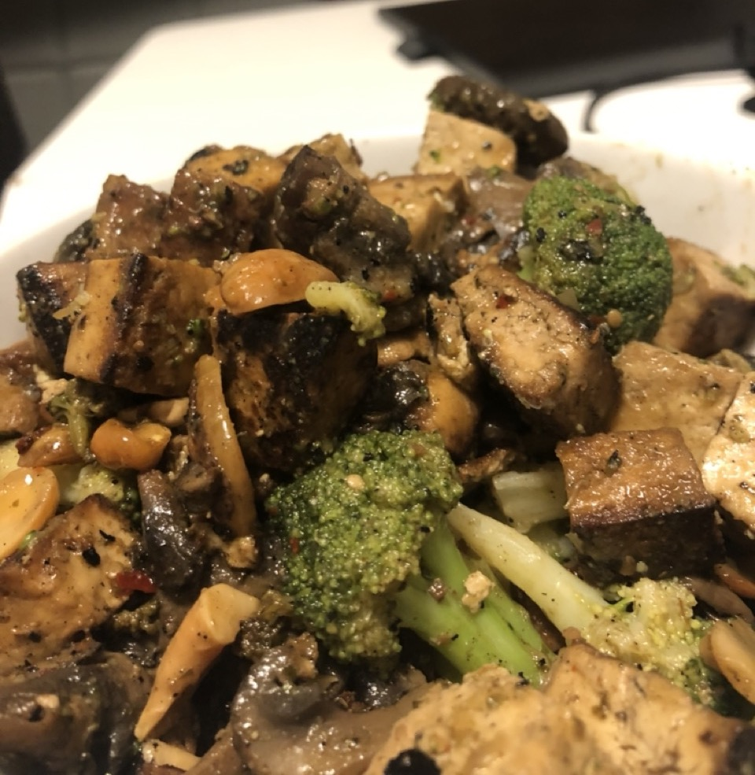

# Spicy Cashew Tofu

## Ingredients
- 2 packages of extra firm tofu
- 1 package of mushrooms
- 1/4 cup of cashews
- 1/4 cup of soy sauce
- 2 teaspoons of sesame oil
- 2 tbsp of green chili sauce
  - Green Dragon from Trader Joe's
  - Or other Thai green chili sauce
- 1/2 teaspoon of
  - garlic powder
  - onion powder
  - chili flakes
  - paprika
  - black pepper
  - salt

## Directions
1. Press the tofu. Wrap it in paper towel, place on a plate with a heavy pan on top to force out the moisture
2. Dice the tofu into 1 inch cubes
3. Split the cashews in half and slice the mushrooms
3. Oil the pan and fry tofu on high until golden brown and crispy, ~3 minutes
4. Add the cashews and mushrooms to the pan, let it all cook for 2 minutes
5. (Optional) add in broccoli florets
5. Add all of the spices
6. Add 1/4 cup of soy sauce and a 1/4 cup of water
7. Cook for a few minutes, until no liquid remains
8. Serve on rice, and top with chili sauce and sesame oil
