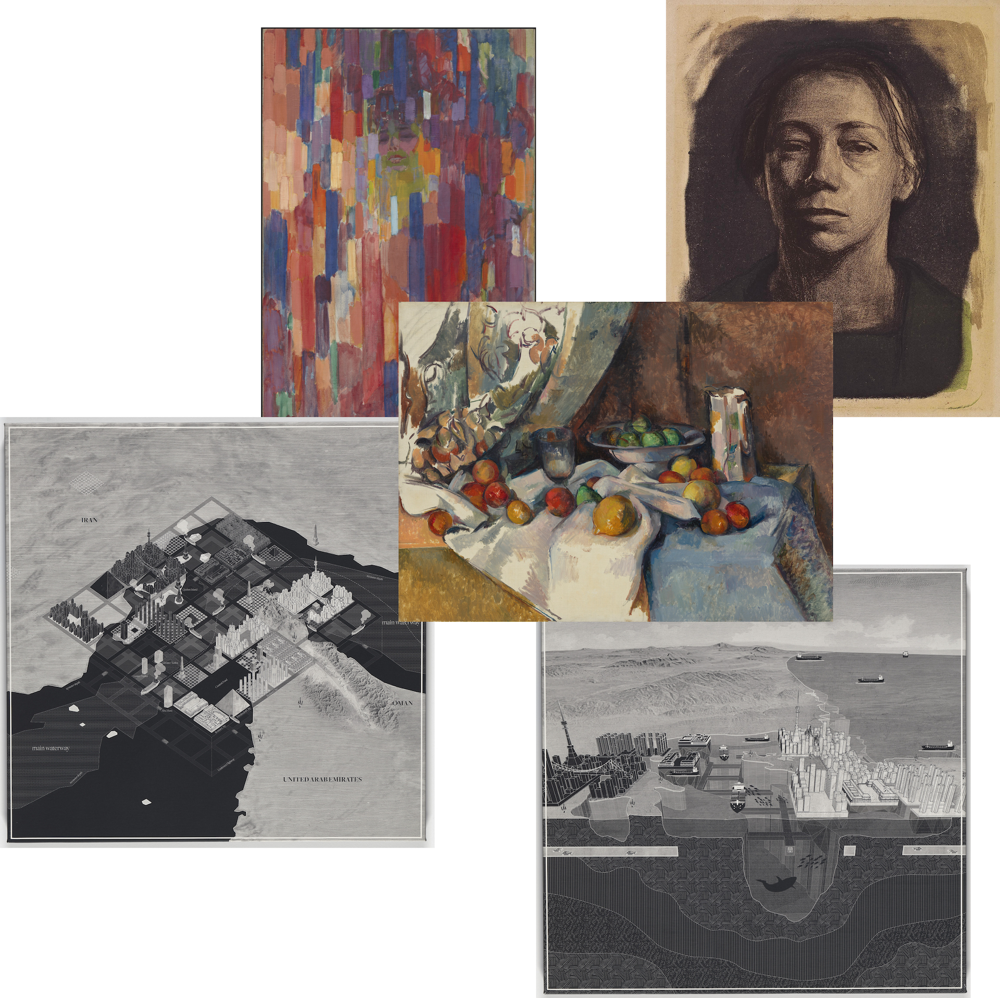
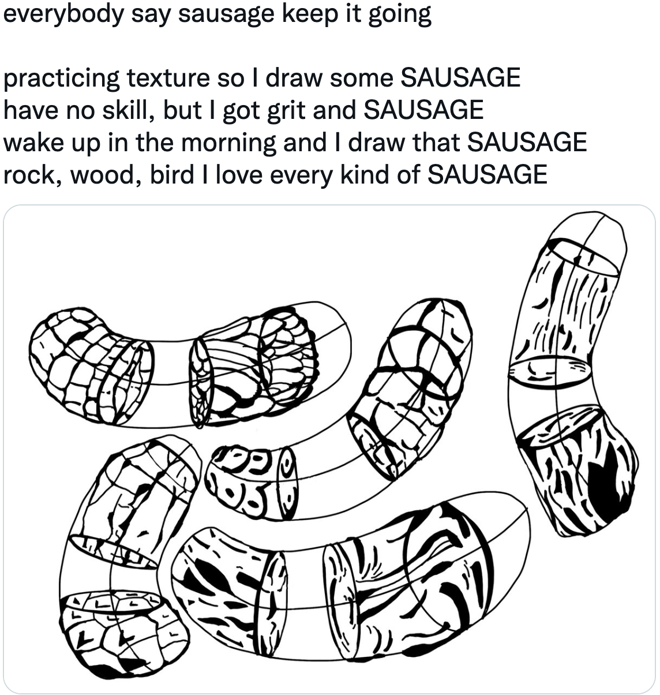
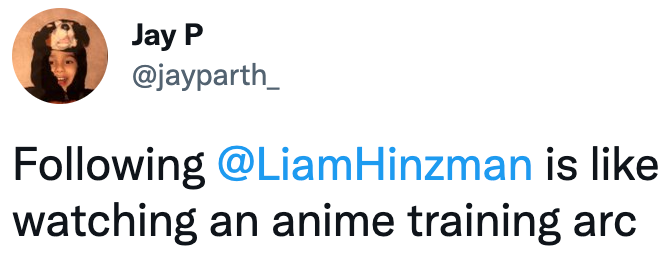
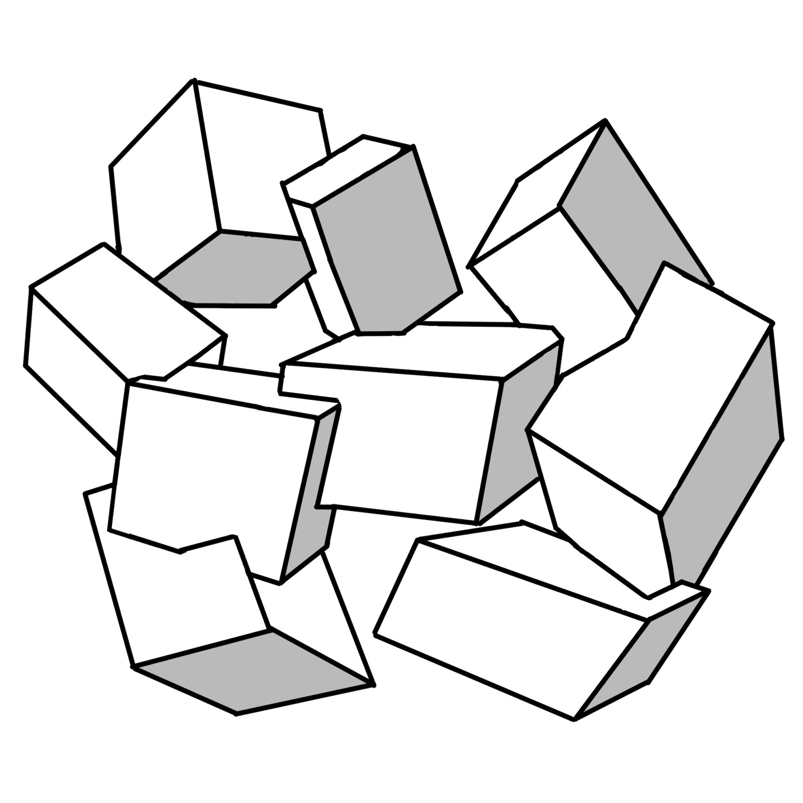
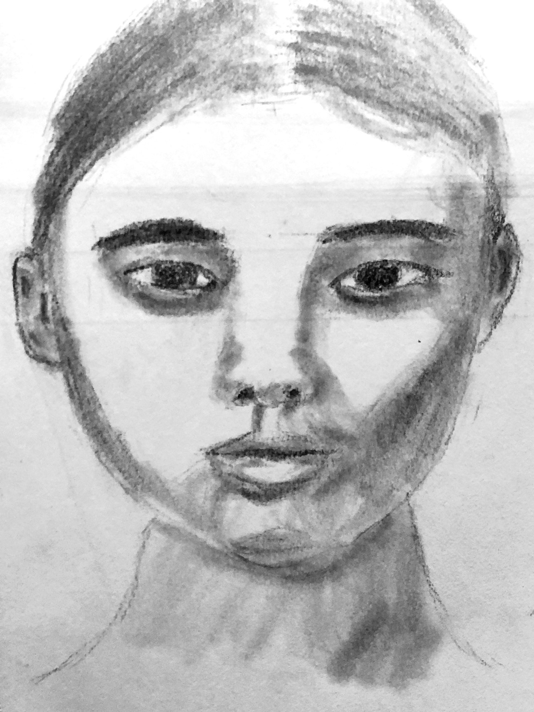
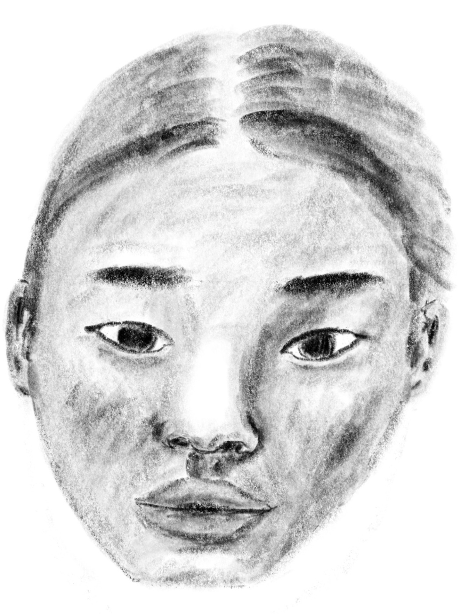
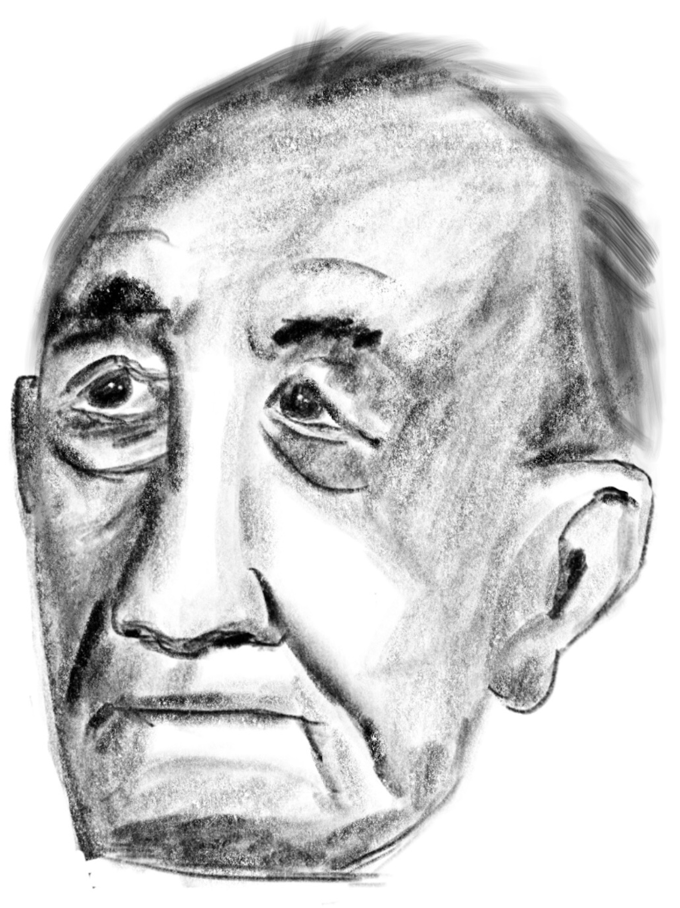
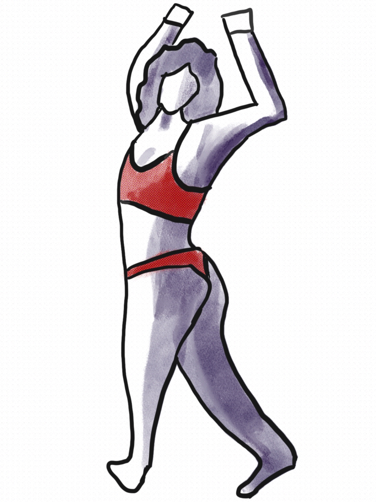
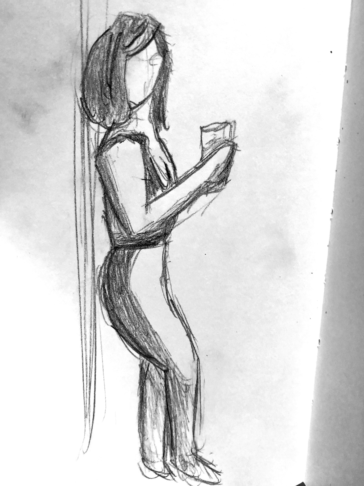

# August Week 3
## Thursday, August 16
While cooking lunch for the house this morning, MP called me and told me that "we think you should leave Numerai in the next week -- since you'll be happy to leave early"

I was originally going to leave November 4th, to save up money before starting my sabbatical

For the next 4 hours I was pissed, yet doing everything I could to figure out how I'd manage to pay rent for the rest of the year
- Put together a spreadsheet to figure out how screwed I was financially
- Wrote a multi-paragraph note to the CTO and CEO imploring them to let me stay
- Messaged four friends asking for part-time or 8 week contract projects
  - Had a call with Weiwei asking if I could work full-time
  - Set up two meetings for potential employment

Then at 3pm, CEO sent me a note saying that he has no idea what's going on, and that me leaving was entirely MP's idea.

Turns out that MP thought he was doing me a favor by giving me an out to leave early. I don't know why he's so terrible at communicating, but it is what it is -- he called me a second time saying that I'd have to be in-person to stay, and when I said I wouldn't be able to make that work he said he'd talk to the CEO

When I got CEO's note, and realized that it was all miscommunication and silliness from MP, I felt a huge weight of stress lift -- it felt euphoric.

## Wednesday, August 16
Got lunch with Weiwei and design coworker by the water.

The topic of favorite books came up, and she recommended [Understanding Comics](https://www.goodreads.com/book/show/102920.Understanding_Comics), a book that  explores the history and techniques of comics. Apparently it's been a large influence on she approaches UI and UX design

I recommended [The Art of Learning by Josh Waitzkin](https://www.goodreads.com/book/show/857333.The_Art_of_Learning). Generally I feel that most advice is very domain specific and doesn't generalize well (e.g. Chess masters don't actually know the secrets to success in life and business), but I love this memoir because Waitzkin became the junior world chess champion, he dove into Tai Chi Chuan (combat version of Tai Chi) and after several years won the world championship for this. He tries to piece together the common things that helped him reach mastery in these two areas.

Weiwei observed that my desire to do art has similar motivations. Being great at programming isn't enough, I feel the need to become great at something very different (art) to affirm the belief I'm special

> Everybody is identical in their secret unspoken belief that way deep down they are different from everyone else - David Foster Wallace

## Tuesday, August 16
Had a call with Weiwei, and agreed to work on Roller for a day or two this week

Went to her apartment to cowork. It was fun to see web apps for early stage startups are set up (a mess of NextJS, Prisma, and React) and quickly grok the code base so I could start building

Went bouldering underneath the brooklyn bridge with TA and JW, and then walked across the bridge together

## Monday, August 15
Day 1 of vacation!

I haven't taken time off in a year, it'll be nice to take a break from work at Numerai for the next two weeks

Life will get in the way, but my goals for the week are to...
- Draw for 30 hours
- Learn how to ollie up a curb
- Go to museums: MET / MOMA / MOMI
- Go kayaking and [bouldering underneath the brooklyn bridge](https://www.dumbo.thecliffsclimbing.com/)

Went to the MOMA with JW, some favorite pieces below

# August Week 2
## Sunday, August 14
Had to do Numerai work for 5 hours to wrap up things before starting my two weeks of vacation, since I didn't work much on Thursday and Friday because of Interact's symposium

Went bouldering with JW, then headed to Interact's after-after party
- Unfortunately most of my friends had already left NYC
- Ate shake shack under the brooklyn bridge
- Played ping pong while tipsy with JW
- Corey lived on this [farm](http://bethelfarm.org/spiritual-bb/) during Covid, and suggested that I do the same for two months during my art sabbatical next year

## Saturday, August 13
Day 3 of Interact's symposium was filled with people in the residency program presenting their work from the past 2 months

*Mammoths and the Post-Anthropocene with Wendi Yan* \
Seeing Wendi present on her film (read logs from prev. day for context) was a joy. She showed an 8 minute short film which was fun to be entranced by, despite her saying that none of this footage would end up in the final cut.

*Technological Literacy with Anna-Sofia* \
One panelist was the former managing editor at TechCrunch. He mentioned that the number of clicks your media gets isn't a good measure of audience, since most of those people don't actually give a shit beyond momentary entertainment. Preaching to the choir isn't that appealing, so audience is the small amount of people you can convince to deeply care.

*The Neighborhood New York City with Priya* \
A strong case for East Williamsburg, near Lorimer station, being the best neighborhood in NYC was made: it's on the L line, near Vital climbing, and has several coliving houses nearby. Also learned that NYC local governance is surprisingly easy: you only need ~1000 signatures to turn an area into a "slow street", and it's easy to get free materials from city agencies (e.g. planting trees and providing trash bins)

*RFID Tags and New Computing with Omar Rizwan*

*Structuring Digital Information Flows with Saffron Huang* \
I was only in the person in the audience of two dozen who did the pre-readings of a 15 page research paper and Saffron's substack post on privacy, so I came prepared with questions! Asked her how she thinks we'll ever get to a world where large consumer companies respect privacy, since they have no incentive to adopt privacy preserving technologies.

After a bit of thought she responded that new technology enables new regulations. E.g. for certain risky areas, government can demand audit of algorithms via ZK in a way that preserves IP.

It's also not necessarily the case that privacy is a tradeoff between utility and morals, since privacy tech enables new forms of expression. E.g. being able to discuss online and show credentials such as your research h-index without revealing your identity

Talked with Saffron for a bit afterwards about what she thinks she'll end up doing in privacy. There's a spectrum between building applications, doing research, and advocating for regulatory changes -- she leans towards doing research with organizations like [OpenMined](https://www.openmined.org)

*In the evening...* \
Got dinner with TB and met Linus Lee for the first time. At one point I asked what Linus has been up to lately, and TB asked "wait, do you not know who he is". I said yeah, but didn't want to be the lame fan person who says "omg I love Oak, how are you so prolific"

Played Chess with Interact people. Said hi to the person next to me, we exchanged names and for a hot second we were perplexed, since we recognized each other, but weren't sure from where. Eventually I mentioned that I was going on art sabbatical, she exclaimed that she was too, then we realized I had DMd her about her thread on sabbaticals a month ago

Talked with Weiwei for two hours about sabbaticals, being lost while exploring life, and her work at Dynamic Land & current startup

*Parting thought* \
On the way to the symposium in the morning I had the realization that nearly every conversation I have goes incredibly well, yet I still have a fear of talking to new people. I'm happy with how I pushed myself to talk to more new people today, but need to keep this in mind for the future as well.

## Friday, August 12
Day 2 of Interact's symposium was filled with panels \
I took lots of notes, but will just include the one thing that stuck with me the most from each

*What education could be with Matthew Jordan* \
Education as a means (to get a job) vs as an end (for the love of the craft). People who end up defining new paradigms are the latter, and this usually includes them learning the history of their craft, so they can build upon it.

*State of venture capital with Kevin Kwok* \
YC is just business school that's palettable to engineers. \
The real VC is the friends we made along the way, since everyone went into VC

*Models for co-living with Jason Benn and Devon Zuegel* \
Jason Benn started the best group house, The Archive, and is now working on [The Neighborhood SF](http://neighborhoodsf.com) which one of my favorite projects in the world. I've followed him for a while, but hearing him speak in person has made me a believer: scenius will form around him.

*Why are we so wimpy with Molly Mielke* \
One panelist was asked "when was the time you felt most courageous" and they responded that it was when they decided to go back to university in Ireland and enjoy life instead of following their peer group to become a founder in SF and raise millions of dollars.

I spoke to him afterwards, and told him that I felt similar, and was making a similar decision w/r/t leaving AI to pursue art. He said that my blog post on the shallowness of SF parties matched his experience, I said "wtf, how did you find that". Turns out he saw me drawing yesterday, thought that was interesting, and looked up my name / website via the Symposium's group chat. New friend! He's the first person I've met in person who's also read Infinite Jest.

In the evening, walked to shake shack with Marley, Santi, Brunella, and Priya -- the last of whom is following in Jason Benn's footsteps and organinzing The Neighborhood for NYC.

## Thursday, August 11
Interact is hosting a symposium from today through Saturday, and thanks to AY I got an invite.

Skateboarded through Brooklyn for the first time, and after arriving I drew for two hours.

Attended the circle on "empact", a discussion on how to turn emotions you feel from impactful media into real world action. They showed a short animated film on the grief of parents who live on after their child dies in a school shooting.

The discussion started off pretty dull, so I talked about
- My recent experience with the death of a dog
- How I feel silly about only being able to think about my own little problem rather than the larger national issue
- How you have to choose to not be jaded to be moved by art

After the session ended, I ended up going on a 20 minute walk with one of the two organizers and got to hear about their frustration on their inability to get people to act. In all of the sessions she's run like this, everybody says how much they're affected by the film and how they wish they could do more, but almost nobody clicks on the QR code / links she provides at the end.

The disconnect that many have between pretending to care about topics to appear pro-social and actually caring when on one's own bothers me.

In the evening, went wandering the neighborhood with Brunella (new friend!) for an hour, shared life stories, and then found ourselves in the basement of the Interact residency house where [Wendi Yan](https://wendiyan.com) was presenting early work on her in progress sci-fi documentary.

It was such a unique experience
- Dark basement, lit by flashlights that dangled from the ceiling
- Disjointed footage of the arctic and Unreal Engine motion graphics
- Haunting singing in a foreign language with heavy reverb
- A table of artifacts, sci-fi world building documents, books that inspired her work, and the work journal she's used the past 3 months

Some stills from her film

## Wednesday, August 10
Coworked at Verci with JW and TA, and then sat in on the first live session for [Kenzo's life drawing study group](https://community.lovelifedrawing.com/the-life-drawing-study-group). I really like his way of teaching, and will probably stick with this study group until the end of the year.

In the evening we walked for two hours walking through Washington square park, Noho, and Soho for two hours. Eventually made our way down to the arcade at Chinatown Fair and played DDR for a bit.

When visiting new cities some people like sampling restaurants, and others tour museums. Mine will be dancing at arcades.

Went to a Jazz bar and caught up with TB -- my drawing progress and his experience with synthesis school.

## Tuesday, August 9
Worked from home. Went to a cafe's chess club, and met up with the PUA person I met on the same night as AY. His dating startup failed, and he's now a dating coach for middle aged men, going out with them to bars and making $150/hour. A fun reminder of how different the lives of I've interacted with can be.

Played chess for a few hours with Bushwick hipsters, then went to a PC cafe.

## Monday, August 8
Went to the NYC main library's Rose room to work, and as soon as I walked in I had flashbacks to the last fall when I was here and all the fun I had with AY and JJ.

Wandered up 5th avenue with JW, and bought some shorts at Uniqlo because I was unprepared for the East coast heat wave.

Cooked spaghetti for the house while TA played Smash. Every now and then I'd glance over to see how he was doing, and for the first time viscerally understood the "are ya winning son" meme 

# August Week 1
## Sunday, August 7
Walked through Bushwick for the first time with TA while doing laundry and buying groceries. I really really like it here, so much more than SF. Streets are busy and grungy in that perfect way in which they feel lived in by people from all types of backgrounds.

Had the song [I Think I'm Gonna like it Here](https://youtu.be/xsQHuiLTgp4), from the 2014 version of Annie, playing in the back of my head while walking the streets despite not having this film for years.

Went bouldering at MetroRock Bushwick with TA and JW. Glad to see that I'm still a V3 climber on the east coast.

## Saturday, August 6
Caught up on sleep. TA arrived at the Airbnb, then we went downtown for a concert

Seeing Polyphia live was so good. Tim Henson is fun to watch in person, and the songs (and probably metal music in general) get me and the crowd so amped up.

Walking back home at midnight we saw so many hot young people out and at bars. Streets being vibrant at night is something I didn't realize how much I was missing while in SF until now.

## Friday, August 6
Ever since living in New Mexico, whenever I leave a place I called home, I listen to [The Making of a Paracosm by Kasbo](https://open.spotify.com/album/4yrjPmonSHiJIHum5TrqEe?si=bevvX9QBTNyiidC9tCqMxw) on the plane. The euphoric synths and vocals in the first 4 songs of the album capture the melancholy I feel when closing a chapter of life.

While on the plane I found my mind drifting to my exes: BG and NZ. They were defining parts of the person I was the past two years in SF while working at Numerai. Defining parts of this life I'm leaving behind.

Landed in NYC at midnight.

## Thursday, August 5
Said goodbye to all my coworkers who come to the office in-person, and to our massage therapist.

Got dinner with MP, Jonathan, and Ben (coworkers) at Burma Superstar, then went to a bar and talked for a few hours. I got kicked out of the bar for being under aged, so I ended up leaning against the railing while the lads drank at a table on the patio. At one point I grabbed my glass of water to drink, the bartender saw and ran out to tell me to stop, and I chugged the glass while staring him in the eyes.

## Wednesday, August 4
Finished packing and completely emptied out my apartment

Watched Ghost in the Shell (1995) at the Cohere office with JW

I love how it was a slow film that threw you into the middle of everything

Largely vibe driven, with a plot that you have to slowly piece together

The three interlude scenes, where there was no dialogue and only music with shots of the city felt magical

## Tuesday, August 3
Completed a significant refactor of the Numerai tournament website that I started yesterday -- all the engineers were surprised and happy with it when I presented the changes

Played League of Legends at f.inc with JW, AA, JP, and SA for a few hours.

Slept over at the Cohere office

## Monday, August 2
Posted this on Twitter

Jay responded with this

Leaving everything behind to live a different life is exciting, I'm optimistic about this next arc of my anime.

Drew intersecting boxes for the first time. There was a solid 20 minutes where I couldn't figure out how to do it properly (the tutorial wasn't very helpful) and almost called it a night, so when it clicked it felt euphoric.

# July, Week 3
## Sunday, July 31
Went on a 2 hour walk with a girl that I hung out with for a month, then stopped talking to back in May. We caught up on life, her recent trauma, my sabbatical plans, and sketched out plans to backpack Europe or Thailand if I'm up for it next January or July.

At the end we played DDR for an hour.

It was really nice to catch up, and have some closure with the last person I wanted to say goodbye to in SF.

Got a response from BG, my first ex, on the email I sent her a few days ago -- it's our second email exchange since breaking up (the first being on her birthday last month) and haven't talked outside of these letters. I've realized that I'd like her to be part of my life, even if it's just as friends so I'll keep sending her letters every 2 to 4 weeks.

Sold my mattress.

Went to f.inc and played League of Legends with JW and AA for a few hours. It was my 3rd time playing and was so much fun. But it also reminded of my fear of being a CS student at Waterloo addicted to gaming.

I'm happy to play in person with friends whenever the opportunity arises, and I'll just resist the urge to watch videos and git good.

At midnight, while the moon was obscured by clouds, JW and AA helped me hack apart my sleeper sofa and illegally dump it outside.

Slept over at the Numerai office

## Saturday, July 30
Drew in the morning, went climbing with JW and AA, then drew some more.

I’m feeling a lot better than I have the past few days. Hoping that I’m out of the post-death funk.

## Friday, July 29
After I told CTO yesterday that I'd be leaving, he said that I was one of the smartest people he's worked with, and appreciated my outlook on life over the past two years. This was really nice, but I wasn't sure how much of it was hollow flattery. Today he asked me to let him invest $30k whenever I start a company. It's nice to have others believe in me.

My ex posted a life update on Substack, and wrote a few blurbs about how our relationship didn't work out, and how she thinks it's due to previous emotional trauma that she's been trying to work out since then. I messaged her to see if she wanted to call and catch up on life since we parted ways, and sent a similar message to the girl I went to a few concerts with the month before meeting my ex. Feels like I'm slowly saying goodbye to SF and the people who defined it for me.

The past few days I've been unmotivated to do much in the evenings, I'm accepting this as a temporary lull. Dog's owner sent out an obituary email, and thanked me and Angela for helping. Cried a bit, then drew for the first time since the potluck.

## Thursday, July 28
Still don't feel great, but a bit better than yesterday.

Told RC and CTO that I'd be leaving Numerai in October. They were both sad, but overall took it really well. RC appreciated me giving him such a large heads up, and we did a bit of an exit interview. RC also asked some good questions about if I thought I'd become complacent as a middling artist and not end up with much a legacy — in the long-term, I don't think so.

I'm happy focusing on improving my skill at art for the next year or so, but I know the itch to make a name for myself will come back sooner or later. This is also why I'm not too concerned about making money, I know that I'll end up working at some point, and whatever it is I do I'll do it very very well.

Finished reading Tigana

## Wednesday, July 27
Sometimes when I'm on public transit my brain will zone out, and I won't be present.

I wasn't present at any point today.

I feel so hollow and disconnected. Every time I became aware of my surroundings again I'd think of the dog, slowly dying in my arms, and I'd flinch away from that thought and immediately go back to zoning out.

After failing to get work done for a few hours, I wrote a letter and skateboarded down to drop it off with flowers. When I saw the owner, I just started crying. I couldn't find any words to say, so we just hugged for a bit.

Went to the gym, and right after I got back Kipply asked if I wanted to play DDR with her at Ghirardelli. It was a nice distraction.

## Tuesday, July 26
Took the day off from work and drew at the Cohere office, and later on WeWork with JW, JP, and SA

Went to a potluck at TR's, arrived early to cook spicy cashew tofu and caught up with him about
- Me leaving tech to do art
- His feelings on how the engineer mindset is to mindlessly execute, with minimal creative self expression — and how the nature of game dev / film studios necessitates the opposite
- Synthesis school grievances, seems like he'll also go on sabbatical soon

Ended up making a new friend, Angela Fan, talked about our experiences in…
- finance and how it made us realize we don't care much for money
- software dev (me) and product design (her), and how we grew to feel that this isn't what we wanted our legacy to be

Also asked her if any of her artist friends managed to make ends meet while doing what they love. Her artist sphere is more experimental than commercial (few concept / studio artists). Most of them are struggling financially, but a few have landed residences or built a lucrative following.

One thing that stuck with me is that the good life for an artist is just being able to do their job while being financially stable. This is in stark contrast to engineers where having a job is assumed. Making art leads to a more frugal life, but I think also indicates that it's more rewarding.

At the dinner party, me and the dog would run down the stairs every time the doorbell rang to let in people. After a few hours, most people had gone upstairs to talk, while me, Angela, and two other stayed downstairs.

I was petting the dog, and became a bit concerned since it seemed so lethargic. Angela started petting the dog and also was wondering if it had a stomach ache. After a few more minutes I decided to get the owner. He called the vet, while the dog's breathing got weaker and weaker.

I kept petting and petting, while breathing with the dog because I was terrified that he'd stop at any moment. Eventually the dog pooped itself while still on the ground, and shortly after we carried it downstairs. When we got him into the car, his breathing was very weak, and shortly after he started gasping and spasming.

The owner drove his dog to the vet, and the rest of us stayed behind to clean up for a bit.

Angela drove me home, and while en route I got a call that the dog died.

## Monday, July 25
RC reemerged after a week of no-contact to announce that he's moved to NYC. Feel bad that both me and him have left MP -- I hope he does alright.

I had taken the day off work today, but ended up getting roped into 4 hours of work anyways. Not ideal, but freedom is only a few months away.

Watched American Psycho with JW, some thoughts:
The richness of your interior life doesn't matter much if none of that is reflected in your actions or how you treat others

Jung's concept of the shadow. Most of what I dislike about others is because I fear or dislike some part of that in myself. I see my shadows in others w/r/t stagnation, not following through on personal goals, not being interesting to others, and not having anything to say that carries meaning.

It's easier to love others as they are when I'm aware of why I instinctively judge them.

# July, Week 2
## Sunday, July 23
AY and JM flew in from Arizona, and me and JW threw together a SF adventure for them

- Dinner at New Thai Elephant
- Biked to the Palace of Fine Arts, witnessed an ethereal violinist
- Biked to a fog obscured Golden Gate Bridge, overcast and spooky stranger things vibes
- Biked back home

This whole adventure was so much fun, and I want to create a lot more memorable experiences for the people I care about over the next few months.

Am sad that JZ sat in the car reading instead of joining us. Feels like he doesn't want to mend things between us, and that this won't ever change.

Also a bit sad at not getting an invite from AY for group hiking at Big Sur or roadtripping to LA. It's probably for JZ's sake and capacity reasons.

But shared time is rare, life is short, and I've been putting in a lot of effort to spend more time together in person. Not having this reciprocated stings.

All that being said, I'm grateful for the past 9 months together and all the ways I've grown because of that. Those months matters more to me than the past week or two. Life gets busy, close friends make mistakes, and yet I will happily choose to love them regardless over and over again.

## Saturday, July 23
Went to Marufuku ramen and then watched Nope with JW, MP, and BB

## Friday, July 22
I finally told MP that I'll be leaving Numerai in October. After a short pause, his first response was "I'm happy for you" -- there was a bit of silence after since we didn't know what else to say, but after a minute or two we started making jokes about it while lifting at the gym.

He mentioned that he'd feel a bit bad if I was leaving to join another tech company or hedge fund, but seems quite happy for me that I'm going on sabbatical to explore art and other things.

Having the coworker I'm closest to know that I'm leaving, and him being okay with it, makes it feel like a weight's been lifted.

## Thursday, July 21
Yesterday me and MP launched a big revamp to Numerai's internal universe. A lot of stuff broke this morning, and most of today was bringing everything back to life.

Went rock climbing with MP and JW

Played guitar for the first time in months. I sold my piano a few weeks ago, and am now feeling the itch to play some music again -- hoping that I'll end up getting good at guitar over the next few months, but we'll see where life takes me.

## Wednesday, July 20
I really respect Magnus Carlsen giving up the world chess champion title today, it's hard to do what you know is best if there's large social pressure to stay stagnant

## Tuesday, July 19
Went to the Cohere SF office with JW. Got a bit of work done, then drew for an hour. I'm able to draw heads just as well on iPad as paper now

The reference I drew from today was actually one I drew 3 weeks ago. In the pencil/paper sketch I didn't want to shade the left half b/c I was worried I'd mess up the sketch. Comparing the two is a nice example of how I'm more willing to shade more boldly on the iPad since erasing is so much easier digitally

Went to a TKS dinner party. To a former TKS director: "I'm leaving tech for a bit to go study art" -- "Cool! Like Paul Graham"

I want to become the Hayao Miyazaki of video games. A medium and genre defining prolific creator.

This is what I want my art practice to eventually lead to, but I'm in no rush to get there. 

The plan is to still study art, but I definitely want to play some games published by Annapurna Interactive (the A24 of video games), experimental interactive fiction with unique art styles and mechanics, and participate in a game jam every other month or so

## Monday, July 18
I do leg day once a quarter \
Today was leg day with JW \
Pain

Sold my OP-1 to a guy off Facebook marketplace for $800 in cash. Was stressful having a sketchy guy had me a wad of $100 bills, but we survived
 
# July, Week 2
## Sunday, July 17
Drew for 90 minutes in Delores park with JW. Getting back up to speed with drawing heads on the iPad

Met up with two of JW's friends from last night's party. One of the two was "the hot girl" from the party -- I have a thing for skinny asian girls with Calvin Klein bras now -- but when she talked while sober I went "oh noes". It's weird how many people who seem great at a remove aren't that interesting or personable when you get to know them.

Went to an art book fair. I really enjoyed <a href="https://paragon-books.com/products/sketchbook-6">Felicia Chao's</a> work, but apart from that I was surprised that most of the book vendors didn't have a high degree of skill

Went rock climbing, then ate at Mensho's, my favorite ramen joint

## Saturday, July 16
I beat my first song on the highest SMX difficulty ("Wild")! Has been a big goal of mine the past month -- slowly reaffirming my belief that I can achieve anything I want to in life.

Other goals I have that are self-belief affirming

- Ollie up a curb
- Creating a short animated music video
- Creating an original piano + guitar arrangement of a favorite song and uploading to YouTube

Spent two hours relearning how to draw figures on an iPad. Gonna relearn how to draw heads on the iPad over the next few days

Went to a college frat party with JW, my first!

- "What's been on your mind lately? Where's your head been at?" is a great conversation opener with guys, but doesn't seem to work well as often with gals.
- Compared to tech parties, everybody is gloriously average and just wants to get drunk and talk / laugh
- I did drunk sketches of cute girls and showed them the pic as an icebreaker. Naturally led to fun conversations

## Friday, July 15
Got a 12.9 inch iPad Pro with a pencil! Am very excited to be able to draw digitally: color, easy undo, and layers

JW arrived at my place in the evening, he's gonna be staying with me for the next week

## Thursday, July 14
DH invited me to see <a href="https://www.youtube.com/watch?v=kFRdoYfZYUY">Hania Rani</a>, one of my favorite pianists, live. For over an hour she looped and switched between three pianos -- seeing one person create all that music live was inspiring.

## Wednesday, July 13
Went to a dinner party

## Tuesday, July 12
Interviewed a candidate for Numerai. It was clear that he hasn't coded much the past two years (was promoted to manager), and right after I sent in my feedback the rest of his interviews were cancelled. Feels strange to wield this much impact over another's life.

Went to my first stand-up comedy show with MP -- very fun time, and I have so much more respect for what they do now, I couldn't imagine doing comedy improve live with so much pressure.

## Monday, July 11
Flew back from Vegas to SF. Got on the plane 5 minutes for takeoff

Talked with AY for a few hours in the evening and did a review of sorts of life since we met last November.

# July, Week 1
## TL;DR
RC's birthday in Vegas

Drew 130 boxes over 13 hours

Realized that I'm at the peak of a life that I do not want to live

## Sunday, July 10
Woke up in the Elvis suite, swam in the pool for a bit, played piano while private jet guy played saxophone, and ate breakfast served by the suite's butler.

Talked with CL while eating tacos for lunch. Was nice to hear that the casual drug usage on display at all of the Numerai parties I've been to is much more extreme than anything else he's seen while working

Drew a scene of Venice -- was my first time drawing for fun instead of a study. I enjoyed it, and decided to buy an iPad pro. Am excited to be able to draw in high fidelity with vibrant colors in any cafe.

## Saturday, July 9
In Vegas for RC's birthday party
- Private jet with live saxophone
- Front row seats at Cirque du Soleil (Michael Jackson One)
- Party at the penthouse of Westgate, the suite where Elvis used to live
- Afterparty at RT's house, interior design was what every kid dreams of

There was a dozen times tonight where in the middle of talking to someone they'd do a line of coke.

I'm on the peak of a mountain that I do not want to be on

I do not want to be around these people, talk about money, or do drugs

Met EC, got the sense she was dissatisfied with her finance job. She's like me at a similar stage in life, but more advanced in every way (salary, art skill, education level etc)

I want to live a life and be around people where I can be completely honest with what I'm thinking about and who I am.

## Friday, July 8
Played DDR for an hour and came within inches of beating a song on the highest SMX difficulty ("Wild")

This past week I've spent 13 hours drawing 130 boxes in an attempt to improve my skill at perspective. Normally I draw at home with music on, but tonight I listened to <a href="https://www.youtube.com/watch?v=XZhLzt__lcc">a video</a> suggesting that only doing drawing studies isn't the best -- a large amount of drawing what you love is great to try out different styles, apply what you've learnt in studies, and nurture your soul.

I'm gonna carve out an hour every morning to draw for fun.

## Thursday, July 7
Every other Thursday Numerai has a massage therapist come into the office and give everyone the most wonderful 30 minute massage.

Today she commented on how the shape of my back and its muscles have changed over the past month from me rock climbing.

It's strange to have someone know your body better than your mind.

## Wednesday, June 6
Really enjoying DDR. Am consistently beating the hardest songs on "Hard". Gonna try and beat a song on the highest SMX difficulty ("Wild") this week, which is crazy since this was on my short list of goals in life last month.

Managed to fit in 2.5 hours of drawing boxes during 5 hours of work meetings.

## Tuesday, July 5
I'm happy keeping the number of people I'm close to small, since no matter how busy life is I can always be there for them

## Monday, July 4
Broke up with Nancy two days ago. Despite not finding a life partner I still wouldn't have done anything differently. Committing to a relationship quickly when I feel a spark is what I'll continue doing in the future -- even if things go south it's alright since I'm honest throughout and feel fine breaking things off when I know it won't work out.

Numerai rented a sailboat to watch the Independence day fireworks. Out on the Bay the fireworks were so close that they filled my entire field of view.

# June, Week 5
## TL;DR
- Redesigned my website
- Terminated my lease
- [Completed perspective 1 week 1](/art-home-school/perspective-1-week-1.html)
- Played a lot of DDR
- Learned how to ollie

I feel much more emotionally well and stable than I did last year

## Sunday, July 3
Today was my ideal day: drawing, cooking, skateboarding, talking with AY, and DDR.

Thinking about how I haven't really watched any TV shows / movies, played many games, or read much fiction the past few months -- usually in pursuit of being productive in my free-time.

Letting more quality long-form art and entertainment into my life is important for inspiration. Am most interested in media with unique art styles, interaction mechanisms that enhance immersion, and worlds / characters with depth.

## Saturday, July 2
Coworked via Discord with Alex Honeycutt, the creator of the self study art curriculum I've been following the past two months.

Last week DR mentioned that he considered his attempt to self-study math the past year a failure, because there were often months where he felt intellectually isolated and didn't get anything done as a result.

It was nice talking to and co-existing with another person who left tech to pursue art. I'm gonna continue putting effort into making art friends and contributing to little corners of the internet.

## Friday, July 1
Went to In n Out with JP, talked about how he's feeling burnt as a solo founder, and my essay on why I'm doing art.

I often say "I'm doing art because I like it". There's a lot more nuance to my thoughts, and my joke response is probably indicative of some insecurity

He likes the crackhead energy of dropping everything to pursue what feels right.

"I probably won't make much money as an artists" -- he doesn't believe this to be true as long as I apply a bit of tech thinking: high agency and aiming for the heavy tail

## Thursday, June 30
Got to catch up with DH for the first time in months at the Numerai office party

- Midjourney and the future of illustrators and concept artists
- Me leaving Numerai because I'm young and want to explore more of life. Was nice to have a mentor say that my plan "makes sense"
- Him encouraging me to go to Japan / Berlin instead of holing up in Canada

Wrote [head anatomy 1 week 3 update](/art-home-school/head-anatomy-1-week-3.html)
## Wednesday, June 29
AY recently redesigned their website, which inspired me to revamp mine as well.

Chia and 100R's personal websites have been my favorite for a long time. I've borrowed their multi-column layouts and more prolific vibe for this new site.

Screenshots of my previous and redesigned website

MP told me what him and RC felt that they were missing in life, and asked what I feel I'm lacking in. I wonder if he has a hunch that I'm leaving

## Tuesday, June 28
AY's response to me feeling guilty about leaving was "I think they'd want you to leave and follow your dreams". It's a nice sentiment, but I think the subtext here is "don't you dare wuss out of this"  

This subtext was a nice push to finally email my landlord and request to terminate my lease and move out on Aug 5, the day I fly out for NYC.  

Things are in motion that cannot be undone.

## Monday, June 27
Numerai company onsite this week! Half of our team is remote -- it's nice to have everyone together.

Went to our COO's house and went on a hike, had a pool party, and ate lunch from a taco truck guy.

It was a nice day, but also good to remember that working away at a hedge fund to afford all this isn't my goal in life.

Felt guilty about having fun with coworkers, knowing that I'll soon leave and break everyone's hearts.

